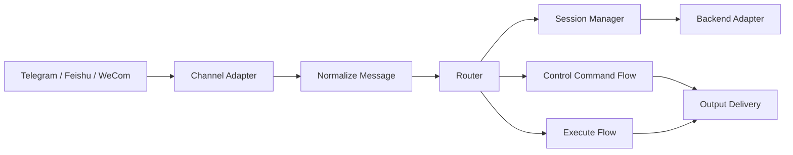
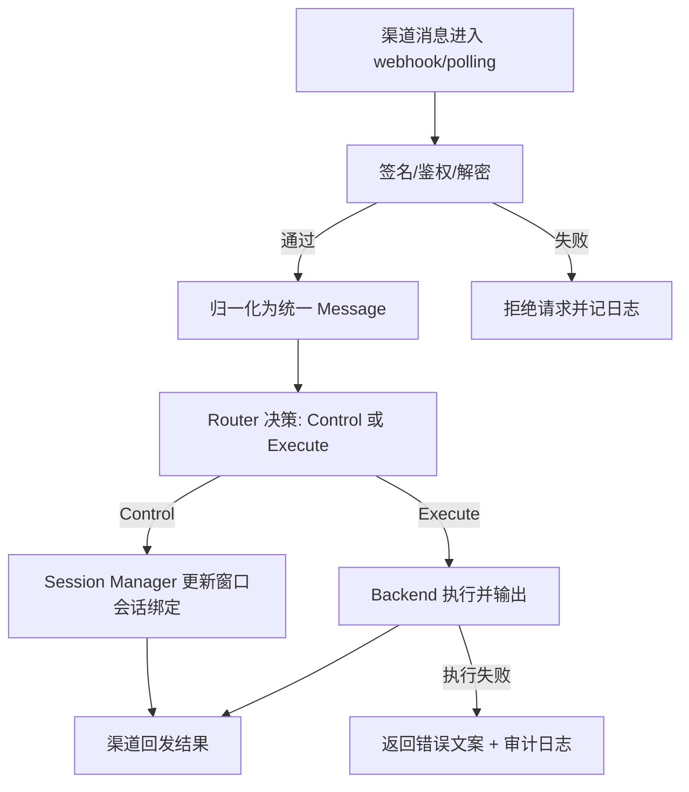
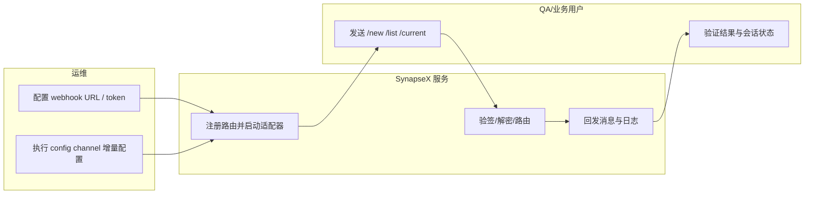

# 004-channels 功能使用指导（版本：v1.0）

## 1. 功能背景与目标

### 1.1 为什么要做
- 业务背景：SynapseX 需要从单一聊天入口升级为多渠道入口，支持团队在既有 IM 平台直接驱动 Agent。
- 当前痛点：
  - Telegram 仅单模式时，部署场景受限。
  - 缺少 Feishu/WeCom 接入时，企业场景迁移成本高。
  - 配置改动容易误覆盖非目标渠道。
- 目标收益：
  - Telegram/Feishu/WeCom 三渠道可独立接入。
  - 控制命令语义跨渠道一致。
  - `config channel <name>` 支持增量更新，降低运维风险。

### 1.2 本文解决什么问题
- 面向角色：研发、QA、运维。
- 本文范围：Wave 1（Telegram 双模式 + Feishu + WeCom + 增量配置 + 指标门禁）。
- 非本文范围：Wave 2~4 渠道代码实现（仅在 specs 中规划）。

## 2. 角色与适用范围
- 研发：本地联调、回归测试、代码映射定位。
- QA：按用例脚本执行控制命令一致性验证与失败分支验证。
- 运维：完成三渠道 webhook 接入与增量配置发布。
- 环境范围：Linux 服务器 + 公网 HTTPS 回调入口（Nginx/Cloudflare Tunnel/ngrok 均可）。

## 3. 整体架构与模块关系

- 渠道适配层：
  - Telegram: `internal/interfaces/chat/telegram/adapter.go`
  - Feishu: `internal/interfaces/chat/feishu/adapter.go`
  - WeCom: `internal/interfaces/chat/wecom/adapter.go`
- 统一编排入口：`cmd/synapsex/main.go`
- 统一消息模型：`internal/interfaces/chat/normalize.go`
- 会话与命令路由：`internal/application/service/*`
- 配置系统：`internal/infrastructure/config/config.go`

## 4. 核心流程

## 5. 跨角色协作流程（泳道图）

## 6. 前置条件与依赖
- 配置文件存在：`~/.synapsex/config.json`。
- 必要密钥：
  - Telegram: `token`（webhook 模式还需 `webhookUrl/webhookPath`）
  - Feishu: `appId/appSecret/verificationToken`
  - WeCom: `corpId/agentId/secret/token/encodingAesKey`
- 运行命令：
  - `go run ./cmd/synapsex serve`
  - `go run ./cmd/synapsex config channel telegram|feishu|wecom`
- 网络依赖：Webhook 模式要求公网 HTTPS 可回调。

## 7. 操作步骤（按场景拆分）

### 7.1 Use Case 文档索引

| 文档 | 适用角色 | 独立验收口径 |
|---|---|---|
| `usecase-us1-telegram-dual-mode.md` | 运维 / QA | Telegram polling 与 webhook 均可完成控制命令和执行链路 |
| `usecase-us2-feishu-unified-control.md` | 运维 / QA / 研发 | Feishu challenge + 签名校验通过，控制语义与主链路一致 |
| `usecase-us3-wecom-incremental-config.md` | 运维 / QA / 研发 | WeCom URL 验证/解密通过，且增量配置不覆盖其他渠道 |

### 7.2 页面操作步骤（示例）
1. 动作：在 Feishu/WeCom 管理后台配置事件回调地址。
   - 入口：对应平台“机器人/应用 - 事件订阅”页面。
   - 预期结果：保存配置时 challenge/URL 验证通过。
   - 失败处理：检查 `msg_signature`、`token`、`encodingAesKey` 与回调 URL 路径是否一致。

### 7.3 接口调用步骤（示例）
1. 动作：检查健康探针。
   - 命令/入口：`curl -sS http://127.0.0.1:8080/healthz`
   - 预期结果：返回成功状态。
   - 失败处理：确认端口未冲突、`serve` 已启动。

### 7.4 本地命令步骤（示例）
1. 动作：运行全量回归。
   - 命令/入口：`GOCACHE=$(pwd)/.gocache GOMODCACHE=$(pwd)/.gomodcache go test ./...`
   - 预期结果：全部测试通过。
   - 失败处理：优先看新增渠道相关测试（`tests/integration/*wecom*`、`*feishu*`、`*telegram*`）。

## 8. 预期结果与验收标准
- Telegram polling/webhook 都可完成 `/new`、`/list`、普通执行。
- Feishu challenge、签名校验、文本消息链路可用。
- WeCom URL 验证、签名校验、解密链路可用。
- 四渠道控制命令语义一致：`/new`、`/resume`、`/switch`、`/list`、`/current`、`/cancel`。
- `config channel` 仅更新目标渠道，其他渠道配置保留。
- 指标门禁：SC-001~SC-006 达标（见 `tests/integration/channels_metrics_report_test.go`）。

## 9. 代码实现映射

| 文档步骤 | 代码位置 | 说明 |
|---|---|---|
| 路由与适配器装配 | `cmd/synapsex/main.go` | Telegram/Feishu/WeCom 路由注册与入站处理 |
| Telegram 双模式 | `internal/interfaces/chat/telegram/adapter.go` | polling、webhook、setWebhook、鉴权 |
| Feishu challenge+验签 | `internal/interfaces/chat/feishu/adapter.go` | challenge、签名校验、文本解析 |
| WeCom 验证+解密 | `internal/interfaces/chat/wecom/adapter.go` | URL 验证、签名、解密、回发 |
| 统一消息归一化 | `internal/interfaces/chat/normalize.go` | Feishu/WeCom 文本映射 |
| 增量配置入口 | `cmd/synapsex/config_channel.go` | telegram/feishu/wecom 交互式配置 |
| 配置补丁与原子保存 | `internal/infrastructure/config/config.go` | `SetValuesByDotKey` + 原子写盘 |
| 跨渠道命令契约验证 | `tests/contract/channel_control_semantics_contract_test.go` | 统一命令语义门禁 |

## 10. 常见问题与排障

### Q1：Webhook 配置保存失败
- 现象：Feishu/WeCom 后台提示 challenge 或 URL 验证失败。
- 排查命令：
  - `go run ./cmd/synapsex config get channels.feishu`
  - `go run ./cmd/synapsex config get channels.wecom`
- 修复建议：核对回调路径与实例 ID，确认 token/secret/aesKey 一致。

### Q2：发送控制命令后无响应
- 现象：渠道侧看不到 `/new` 返回。
- 排查命令：`go run ./cmd/synapsex serve` 并观察运行日志。
- 修复建议：确认路由未冲突、渠道实例 `enabled=true`、网络代理可用。

### Q3：改 WeCom 配置导致 Telegram 异常
- 现象：修改后 Telegram token 丢失。
- 排查命令：`go run ./cmd/synapsex config get channels`
- 修复建议：仅使用 `config channel <name>` 或批量 patch，避免手工全量覆盖。

## 11. 回滚与风险控制
- 回滚方式：
  - 将 `channels.<name>.enabled` 设为 `false`，仅下线目标渠道。
  - 回滚到上一个可用配置快照后重启服务。
- 风险控制：
  - 先在测试环境验证 webhook 可达与命令语义。
  - 生产变更采用单渠道灰度，不同时切换三渠道。

## 12. 变更记录
- 版本：v1.0
- 日期：2026-03-12
- 责任人：SynapseX 开发协作（Codex）
- 变更内容：按 004-channels Wave 1 实现生成总览与用例指导。
