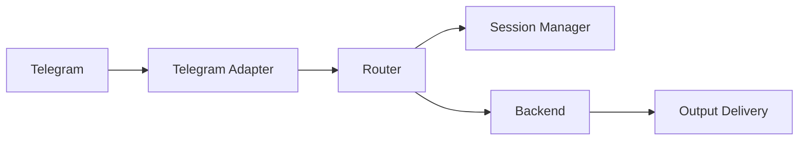
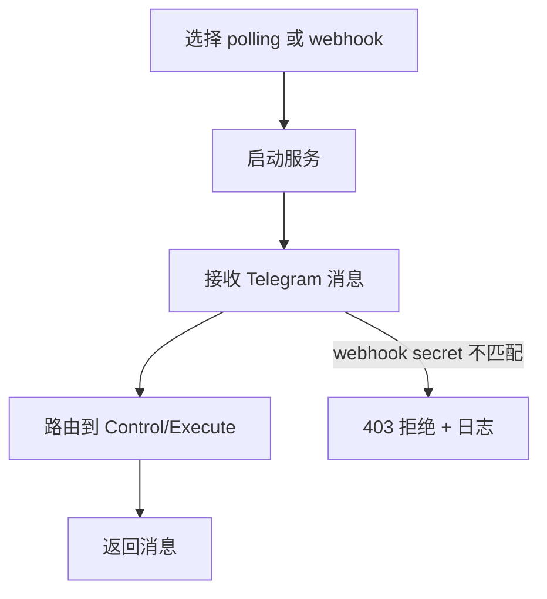
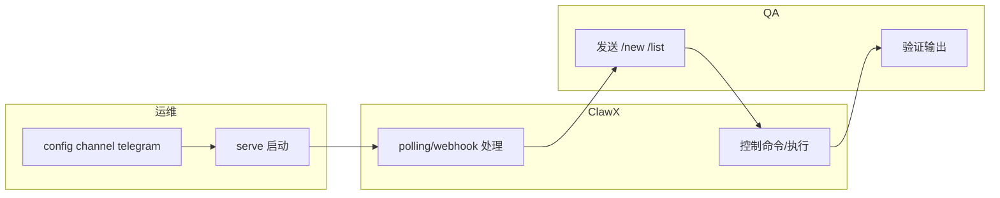

# Use Case - US1 Telegram 双模式稳定运行（版本：v1.0）

## 1. 功能背景与目标
### 1.1 为什么要做
- 业务背景：Telegram 在不同部署环境需要 polling/webhook 双模式灵活切换。
- 当前痛点：单模式会在无公网或高实时场景下受限。
- 目标收益：同一条业务链路在两种模式下都可稳定工作。

### 1.2 本文解决什么问题
- 面向角色：运维、QA。
- 本文范围：Telegram `polling`/`webhook` 的接入与验收。
- 非本文范围：Feishu、WeCom 细节。

## 2. 角色与适用范围
- 运维：配置 Telegram 渠道模式并启动服务。
- QA：验证控制命令与执行链路一致性。
- 环境：测试/生产均适用。

## 3. 整体架构与模块关系



## 4. 核心流程



## 5. 跨角色协作流程



## 6. 前置条件与依赖
- Telegram Bot Token 已配置。
- webhook 模式下 `webhookUrl/webhookPath/webhookSecret` 已配置。
- 服务端口可用。

## 7. 操作步骤（按场景拆分）

### 7.1 页面操作步骤
1. 动作：在 Telegram Bot 管理侧确认 webhook 绑定状态。
   - 入口：BotFather / `getWebhookInfo`。
   - 预期结果：URL 与 `webhookPath` 一致。
   - 失败处理：重新执行 `config channel telegram` 并重启服务。

### 7.2 接口调用步骤
1. 动作：查询 webhook 状态。
   - 命令/入口：
```bash
export BOT_TOKEN=<token>
curl -s "https://api.telegram.org/bot$BOT_TOKEN/getWebhookInfo"
```
   - 预期结果：返回已注册 URL。
   - 失败处理：检查域名证书与反向代理配置。

### 7.3 本地命令步骤
1. 动作：切换模式并启动服务。
   - 命令/入口：
```bash
go run ./cmd/clawx config channel telegram
go run ./cmd/clawx serve
```
   - 预期结果：日志出现 `telegram webhook route registered`（webhook）或 `telegram adapter started`（polling）。
   - 失败处理：检查 token、端口占用、网络代理。

## 8. 预期结果与验收标准
- polling 与 webhook 下均可执行 `/new`、普通文本、`/list`。
- webhook secret 不匹配时返回拒绝，不进入业务链路。
- Telegram 故障时仅该渠道重试，主进程不退出。

## 9. 代码实现映射
| 文档步骤 | 代码位置 | 说明 |
|---|---|---|
| Telegram 路由注册 | `cmd/clawx/main.go` | polling/webhook 分支与 handler 挂载 |
| webhook 解析/鉴权 | `internal/interfaces/chat/telegram/adapter.go` | `ParseWebhookRequest` |
| setWebhook 注册 | `internal/interfaces/chat/telegram/adapter.go` | `SetWebhook` |
| 双模式集成测试 | `tests/integration/telegram_dual_mode_test.go` | polling/webhook 回归 |

## 10. 常见问题与排障
### Q1：webhook 模式无响应
- 现象：消息已发送但机器人不回复。
- 排查命令：`curl -s "https://api.telegram.org/bot$BOT_TOKEN/getWebhookInfo"`
- 修复建议：确认 webhook URL 指向正确路径并可公网访问。

### Q2：服务启动即退出
- 现象：`listen tcp :8080: bind: address already in use`
- 排查命令：`ss -lntp | rg 8080`
- 修复建议：释放端口或调整监听地址。

## 11. 回滚与风险控制
- 回滚：切回 polling 模式并保留 token。
- 风险控制：切换模式前先用测试 bot 验证 `getWebhookInfo`。

## 12. 变更记录
- 版本：v1.0
- 日期：2026-03-12
- 责任人：ClawX 开发协作（Codex）
