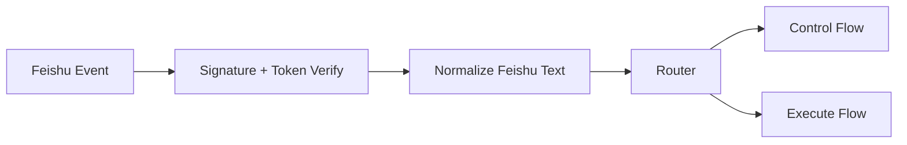
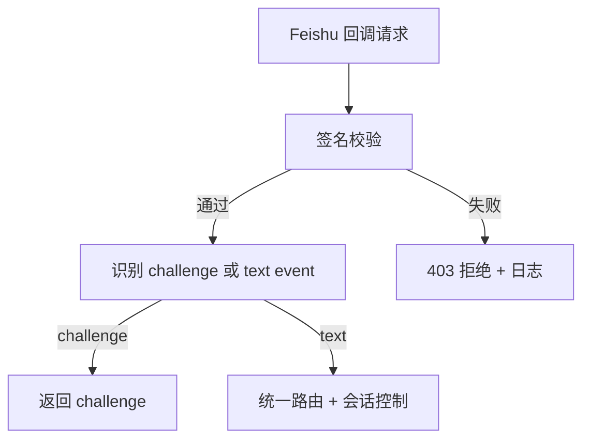
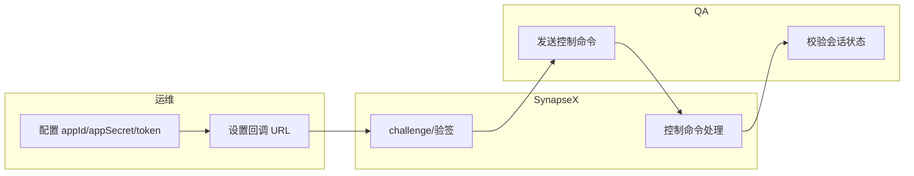

# Use Case - US2 Feishu 接入与统一命令语义（版本：v1.0）

## 1. 功能背景与目标
### 1.1 为什么要做
- 业务背景：企业团队希望在 Feishu 内直接使用 SynapseX。
- 当前痛点：无 Feishu 接入时必须切换平台操作。
- 目标收益：Feishu 可作为独立窗口入口并复用统一控制语义。

### 1.2 本文解决什么问题
- 面向角色：运维、QA、研发。
- 本文范围：challenge、签名校验、控制命令一致性。
- 非本文范围：WeCom 接入细节。

## 2. 角色与适用范围
- 运维：配置 Feishu 应用与回调。
- QA：验证 `/new /resume /switch /list /current /cancel`。
- 研发：定位签名校验与路由问题。

## 3. 整体架构与模块关系



## 4. 核心流程



## 5. 跨角色协作流程



## 6. 前置条件与依赖
- Feishu 配置：`appId/appSecret/verificationToken`。
- 回调路径：`/webhooks/feishu/<instance-id>`。
- 服务已启动并可被公网回调。

## 7. 操作步骤（按场景拆分）

### 7.1 页面操作步骤
1. 动作：在 Feishu 后台配置事件订阅并保存。
   - 入口：飞书开放平台应用配置页面。
   - 预期结果：保存时 challenge 校验通过。
   - 失败处理：核对 `verificationToken` 和实例路由。

### 7.2 接口调用步骤
1. 动作：检查健康和日志流。
   - 命令/入口：
```bash
curl -sS http://127.0.0.1:8080/healthz
```
   - 预期结果：健康检查通过，服务日志可见 `feishu webhook route registered`。
   - 失败处理：检查监听端口和进程状态。

### 7.3 本地命令步骤
1. 动作：执行 Feishu 增量配置并启动。
   - 命令/入口：
```bash
go run ./cmd/synapsex config channel feishu
go run ./cmd/synapsex serve
```
   - 预期结果：可在会话内连续执行控制命令并得到一致语义。
   - 失败处理：查看签名/token 相关错误日志。

## 8. 预期结果与验收标准
- challenge 可通过。
- 签名非法请求被拒绝。
- 控制命令全集与 Telegram/Discord 一致。

## 9. 代码实现映射
| 文档步骤 | 代码位置 | 说明 |
|---|---|---|
| Feishu 路由注册 | `cmd/synapsex/main.go` | `normalizeFeishuRoutePath` 与 handler |
| challenge 与签名校验 | `internal/interfaces/chat/feishu/adapter.go` | `ParseWebhookRequest` |
| 文本归一化 | `internal/interfaces/chat/normalize.go` | `NormalizeFeishuTextEvent` |
| 控制流集成测试 | `tests/integration/feishu_control_flow_test.go` | 命令语义回归 |

## 10. 常见问题与排障
### Q1：challenge 失败
- 现象：平台保存回调时报错。
- 排查命令：`go run ./cmd/synapsex config get channels.feishu`
- 修复建议：校验 token 和路径是否匹配。

### Q2：签名通过但消息不执行
- 现象：返回 `{"code":0}` 但无业务输出。
- 排查命令：查看 `feishu webhook handler error` 日志。
- 修复建议：确认消息类型为 `text` 且内容非空。

## 11. 回滚与风险控制
- 回滚：`channels.feishu.enabled=false`，不影响其他渠道。
- 风险控制：先在测试应用完成 challenge/命令回归再切生产应用。

## 12. 变更记录
- 版本：v1.0
- 日期：2026-03-12
- 责任人：SynapseX 开发协作（Codex）
