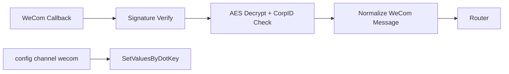
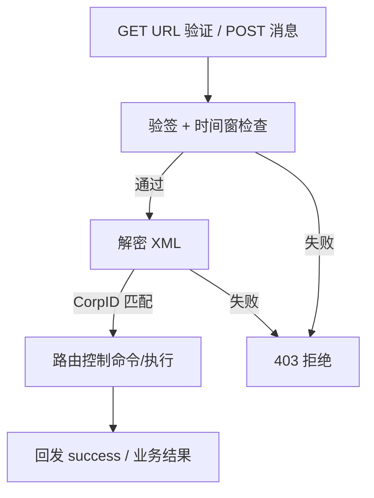
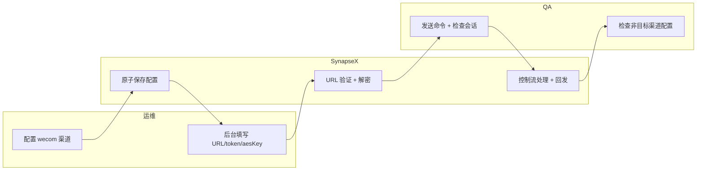

# Use Case - US3 WeCom 接入与增量配置闭环（版本：v1.0）

## 1. 功能背景与目标
### 1.1 为什么要做
- 业务背景：企业微信是关键企业渠道，需要安全接入和稳定运维。
- 当前痛点：
  - URL 验证与消息解密链路复杂。
  - 配置变更容易误覆盖其他渠道。
- 目标收益：WeCom 安全接入 + 单渠道增量配置可控发布。

### 1.2 本文解决什么问题
- 面向角色：运维、QA、研发。
- 本文范围：URL 验证、签名校验、解密、增量配置保留。
- 非本文范围：Wave 2~4 渠道。

## 2. 角色与适用范围
- 运维：完成 WeCom 回调参数与密钥配置。
- QA：执行控制命令一致性 + 配置保留验证。
- 研发：验证解密链路与原子配置写盘行为。

## 3. 整体架构与模块关系



## 4. 核心流程



## 5. 跨角色协作流程



## 6. 前置条件与依赖
- WeCom 配置完整：`corpId/agentId/secret/token/encodingAesKey`。
- 实例路径：`/webhooks/wecom/<instance-id>`。
- 配置文件可写（用于原子落盘）。

## 7. 操作步骤（按场景拆分）

### 7.1 页面操作步骤
1. 动作：在企业微信后台填写回调 URL、Token、EncodingAESKey。
   - 入口：企业微信应用管理页面。
   - 预期结果：保存时 URL 验证通过。
   - 失败处理：检查签名参数与 `CorpID`/`AESKey`。

### 7.2 接口调用步骤
1. 动作：验证服务健康与回调可达。
   - 命令/入口：`curl -sS http://127.0.0.1:8080/healthz`
   - 预期结果：健康检查通过。
   - 失败处理：确认服务进程和端口。

### 7.3 本地命令步骤
1. 动作：执行增量配置并启动服务。
   - 命令/入口：
```bash
go run ./cmd/synapsex config channel wecom
go run ./cmd/synapsex serve
```
   - 预期结果：日志出现 `wecom webhook route registered`。
   - 失败处理：检查配置字段是否齐全、agentId 是否为数字字符串。
2. 动作：验证非目标渠道配置保留。
   - 命令/入口：`go run ./cmd/synapsex config get channels`
   - 预期结果：Telegram/Discord/Feishu 原值仍在。
   - 失败处理：回退到上一个配置快照并重新执行增量配置。

## 8. 预期结果与验收标准
- URL 验证与消息解密成功。
- 签名不合法或重放请求被拒绝。
- `/new /resume /switch /list /current /cancel` 语义一致。
- WeCom 配置更新不覆盖其他渠道。

## 9. 代码实现映射
| 文档步骤 | 代码位置 | 说明 |
|---|---|---|
| WeCom 回调解析 | `internal/interfaces/chat/wecom/adapter.go` | GET/POST、验签、解密、回发 |
| WeCom 路由接入 | `cmd/synapsex/main.go` | `normalizeWeComRoutePath`、`handleWeComInbound` |
| WeCom 归一化 | `internal/interfaces/chat/normalize.go` | `NormalizeWeComTextEvent` |
| 增量配置交互 | `cmd/synapsex/config_channel.go` | `runConfigChannelWeCom` |
| 配置补丁与原子保存 | `internal/infrastructure/config/config.go` | `SetValuesByDotKey`、`writeFileSnapshot` |
| 集成验证 | `tests/integration/wecom_control_flow_test.go` | 控制命令链路 |
| 配置保留验证 | `tests/integration/channel_config_incremental_test.go` | 非目标渠道保留 |

## 10. 常见问题与排障
### Q1：URL 验证返回 403
- 现象：企业微信后台提示验证失败。
- 排查命令：`go run ./cmd/synapsex config get channels.wecom`
- 修复建议：重核 `token`、`encodingAesKey`、`corpId`。

### Q2：消息解密失败
- 现象：日志出现 decrypt failed。
- 排查命令：观察 `wecom webhook rejected` 日志。
- 修复建议：确认 `encodingAesKey` 长度与格式正确（43 字符 key）。

### Q3：配置更新后其他渠道异常
- 现象：Telegram/Discord token 丢失。
- 排查命令：`go run ./cmd/synapsex config get channels`
- 修复建议：仅用 `config channel` 流程或 `SetValuesByDotKey` 风格 patch。

## 11. 回滚与风险控制
- 回滚：设置 `channels.wecom.enabled=false` 或恢复旧配置文件。
- 风险控制：生产先做单渠道灰度，完成 URL 验证与控制命令回归后再全量。

## 12. 变更记录
- 版本：v1.0
- 日期：2026-03-12
- 责任人：SynapseX 开发协作（Codex）
