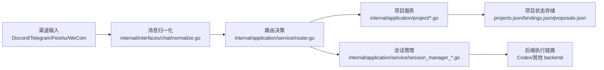
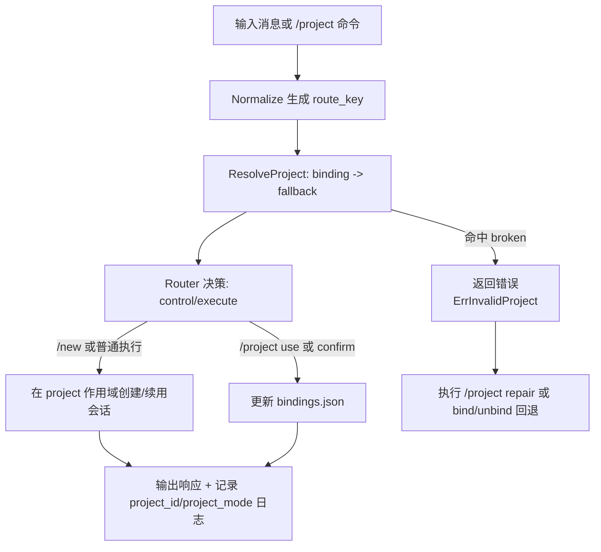
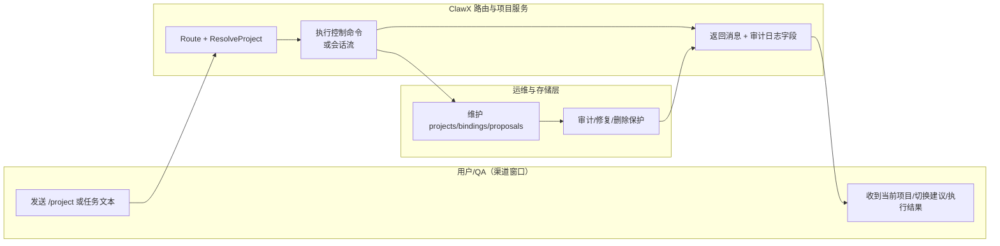

# Phase 5 功能指导：Project Workspace Routing（版本：v1.0）

## 1. 功能背景与目标

### 1.1 为什么要做
- 业务背景：同一个 bot 会在多个 channel/thread 同时处理不同项目任务。
- 当前痛点：会话和工作目录只按 window/session 管理时，容易出现“任务在 A 线程发起却落到 B 项目目录”问题。
- 目标收益：把 `project` 作为一等维度叠加到 `channel -> window -> session` 链路上，实现可控隔离、可观测、可恢复。

### 1.2 本文解决什么问题
- 面向角色：研发、QA、运维、bot 运营人员。
- 本文范围：`/project` 命令闭环、多项目并发隔离、意图建议切换、审计与恢复。
- 非本文范围：新增渠道接入（Wave2+）、跨节点一致性、数据库替代文件存储。

## 2. 角色与适用范围
- 研发：理解路由判定与会话作用域，定位项目串线问题。
- QA：按 US1-US4 独立验收每条链路。
- 运维：执行 `/project bind|unbind|audit|repair|delete` 进行治理。
- 适用环境：`005-project-workspace-routing` 分支，Go 1.23，单节点部署。

## 3. 整体架构与模块关系



- 入口模块：渠道适配器 + 归一化层。
- 路由模块：`Router.Route`、`Router.HandleControlCommand`。
- 项目模块：`project.Service`（create/use/current/audit/delete/repair/proposal）。
- 持久化模块：`ProjectRegistryFileStore`、`ProjectBindingFileStore`、`ProjectProposalFileStore`。
- 观测模块：主进程日志（`project_id`、`project_mode`）与 Phase5 指标门禁测试。

## 4. 核心流程



## 5. 跨角色协作流程



## 6. 前置条件与依赖
- 配置依赖：
  - `projects.workspaceRoot`（默认 `~/.clawx/workspaces`）
  - `projects.defaultProject`（默认 `main`）
  - `http_listen_addr`（默认 `:8080`，用于 webhook 渠道）
- 目录依赖：
  - `~/.clawx/projects/projects.json`
  - `~/.clawx/projects/bindings.json`
  - `~/.clawx/projects/proposals.json`
- 权限依赖：运行用户需对 `~/.clawx` 具备读写权限。
- 数据依赖：至少保留默认项目 `main`，否则 fallback 无法生效。

## 7. 操作步骤（按场景拆分）

### 7.1 页面操作步骤（渠道窗口）
1. 动作：在 Discord/Telegram/Feishu/WeCom 对话窗口输入 `/project create bid Bid`。
   - 命令/入口：渠道聊天窗口。
   - 预期结果：返回 `已创建项目: bid (...)`。
   - 失败处理：若提示已存在，改用 `/project list` 确认状态。
2. 动作：在目标 thread 输入 `/project use bid`。
   - 命令/入口：目标 route 的同一窗口。
   - 预期结果：返回 `已切换当前项目: bid`。
   - 失败处理：若 `project not found`，先执行 create。
3. 动作：输入 `/new` 后发送普通任务。
   - 命令/入口：同一窗口。
   - 预期结果：会话 ID 前缀为 `sess-bid-`，不切项目。
   - 失败处理：执行 `/project current` 检查是否仍为 `mode=binding`。

### 7.2 接口调用步骤（Webhook 链路探测）
1. 动作：探测 Telegram webhook 路由是否已注册。
   - 命令/入口：

```bash
curl -i -X POST http://127.0.0.1:8080/webhooks/telegram/telegram-default \
  -H 'Content-Type: application/json' \
  -d '{}'
```

   - 预期结果：返回 `400` 或 `403`（表示路由存在但请求不合法），不应返回 `404`。
   - 响应片段示例：

```text
HTTP/1.1 400 Bad Request
Content-Type: text/plain; charset=utf-8
```

   - 失败处理：若 `404`，检查渠道实例 `mode=webhook` 与 `webhookPath` 配置、并确认服务已启动。

2. 动作：检查健康探针。
   - 命令/入口：

```bash
curl -sS http://127.0.0.1:8080/healthz
```

   - 预期结果：HTTP 200。
   - 响应片段示例：

```text
ok
```

   - 失败处理：若超时或连接失败，检查 `http_listen_addr` 与进程日志。

### 7.3 本地命令步骤（联调与回归）
1. 动作：启动服务。
   - 命令/入口：

```bash
go run ./cmd/clawx serve
```

   - 预期结果：日志出现 `http runtime listening on ...`（启用 webhook 时）与渠道启动信息。
   - 失败处理：检查配置文件是否合法，特别是 `projects` 与渠道字段。

2. 动作：执行 Phase5 主链路测试。
   - 命令/入口：

```bash
GOCACHE=$(pwd)/.gocache GOMODCACHE=$(pwd)/.gomodcache \
  go test ./tests/integration -run 'TestProject(UseSwitch|RouteIsolation|NewSemantics|SwitchConfirm|BindingRepairCommands|DeleteGuard)'
```

   - 预期结果：测试全部通过。
   - 失败处理：先看失败用例对应 usecase 文档，再检查 `projects/*.json` 内容。

## 8. 预期结果与验收标准
- 主链路：`/project create/list/use/current` 可用。
- 并发隔离：不同 route key 绑定不同项目后不会串 session/workspace。
- 命令语义：`/new` 只新建会话，不创建/切换项目。
- 切换安全：跨项目意图必须先建议，`/project confirm` 后才切换。
- 治理能力：`audit/repair/delete` 路径可用且有保护。
- 指标门禁：SC-001~SC-006 由 `project_routing_metrics_report_test.go` 采集并判定。

### 8.1 代码对齐检查清单（发布前）
- [ ] 路由与命令语义与 `project-command-contract.md` 一致。
- [ ] route key 与会话作用域与 `project-routing-contract.md` 一致。
- [ ] `projects.workspaceRoot/defaultProject` 与当前配置默认值一致。
- [ ] 文档中 `/project` 响应文案可在集成测试断言中找到。
- [ ] 至少执行一次主链路测试命令并通过。

## 9. 代码实现映射

| 文档步骤 | 代码位置 | 说明 |
|---|---|---|
| route_key 归一化 | `internal/interfaces/chat/normalize.go` | 构造 `<channel>:<instance>:<peer>[:thread]` |
| 路由与项目判定 | `internal/application/service/router.go` | `resolveProject` 注入 `project_id/project_mode` |
| 控制命令入口 | `internal/application/service/router_control_flow.go` | `/project` 与 `/new` 等控制流 |
| 项目核心服务 | `internal/application/project/service.go` | fallback、broken 判定、默认项目补齐 |
| 项目命令实现 | `internal/application/project/service_*.go` | create/use/current/bind/audit/delete/repair/proposal |
| 会话 project 作用域 | `internal/application/service/session_manager_create.go` | `sess-<project>-*` 与 `window|project:<id>` |
| 文件持久化 | `internal/infrastructure/persistence/project_*_file_store.go` | 原子写入 + 本地锁 |
| 运行时装配 | `cmd/clawx/project.go` | 注入 workspaceRoot/defaultProject/proposalTTL |
| 渠道执行日志 | `cmd/clawx/main.go` | 日志字段包含 `project_id/project_mode` |
| 核心测试 | `tests/integration/project_*.go` | US1-US4 覆盖 |
| 指标门禁测试 | `tests/integration/project_routing_metrics_report_test.go` | SC-001~SC-006 |

## 10. 常见问题与排障

### Q1：`/project current` 返回 fallback，而不是期望项目
- 现象：输出 `mode=fallback` 且项目为 `main`。
- 排查命令：

```bash
cat ~/.clawx/projects/bindings.json
```

- 修复建议：使用 `/project use <project_id>` 或 `/project bind <route_key> <project_id>` 建立绑定。

### Q2：项目被标记为 `broken`
- 现象：`/project audit` 输出 `broken>0` 或 `project_broken`。
- 排查命令：

```bash
cat ~/.clawx/projects/projects.json
ls -la ~/.clawx/workspaces/<project_id>
```

- 修复建议：执行 `/project repair <project_id>` 重建目录并恢复 active。

### Q3：`/project confirm` 失败
- 现象：提示 proposal expired/invalid。
- 排查命令：

```bash
cat ~/.clawx/projects/proposals.json
```

- 修复建议：重新触发建议（再次发送意图文本）后尽快确认。

### Q4：删除项目失败
- 现象：`/project delete <id>` 报 in use 或 busy。
- 排查命令：

```bash
go test ./tests/integration -run TestProjectDeleteGuard -v
```

- 修复建议：先 `unbind` 路由并确认无活动会话，再执行删除；必要时 `--force`。

## 11. 回滚与风险控制
- 回滚目标：回到“只使用默认项目 main”的保守模式。
- 回滚步骤：
  1. 对关键 route 执行 `/project unbind <route_key>`。
  2. 确认 `projects.defaultProject=main`。
  3. 仅保留 `main` 项目，不再切换。
- 风险控制：
  - 不直接手工编辑 JSON，优先使用命令；若必须编辑，先备份。
  - 删除项目前先审计，避免误删活动绑定。
  - 生产环境先跑 SC 门禁测试后再发布。

## 12. 变更记录
- 版本：v1.0
- 日期：2026-03-14
- 责任人：Codex
- 变更内容：首次发布 Phase5 功能指导，新增 use case 拆分与代码映射。

## Use Case 文档索引

| 文档 | 适用角色 | 独立验收口径 |
|---|---|---|
| `usecase-us1-explicit-project-workspace.md` | 研发/QA | 项目创建、切换、查询与 workspace 初始化 |
| `usecase-us2-concurrent-route-isolation.md` | 研发/QA | 同 bot 多 route 并发不串线，`/new` 语义稳定 |
| `usecase-us3-intent-assisted-switch.md` | 研发/QA | 建议切换 + confirm 生效 + 超时失效 |
| `usecase-us4-observability-recovery.md` | 运维/研发/QA | 审计、绑定修复、broken 恢复、删除保护 |
