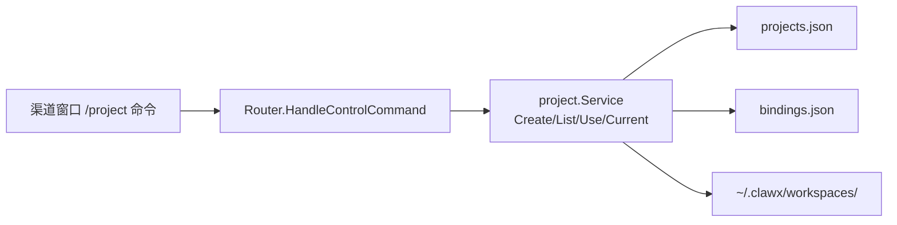
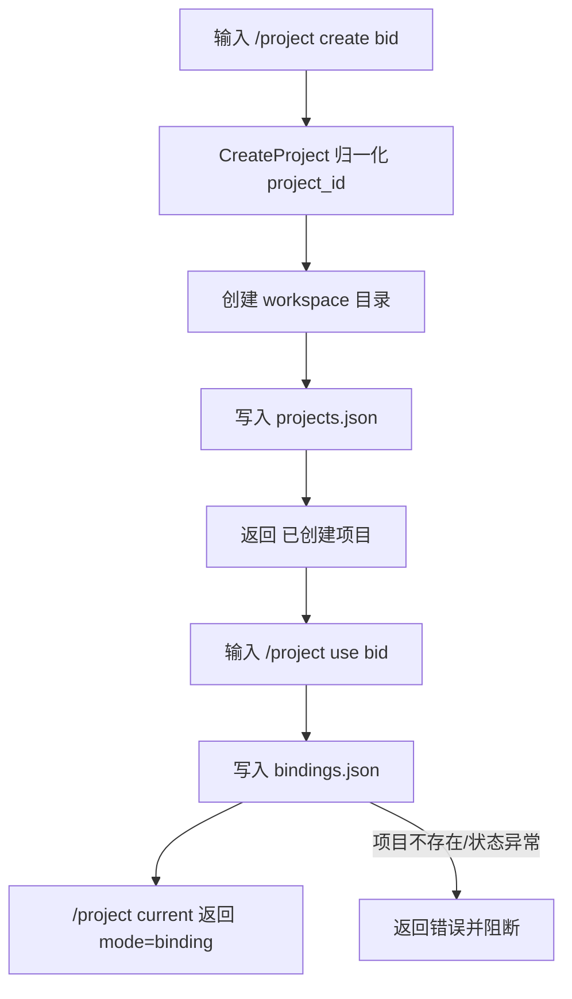
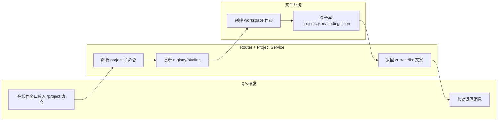

# Use Case US1：显式管理项目与 Workspace（版本：v1.0）

## 1. 功能背景与目标
- 结论：US1 解决“项目创建/切换靠隐式上下文导致不可控”的问题。
- 目标：通过 `/project create|list|use|current` 明确项目边界，并自动初始化独立 workspace。

## 2. 角色与适用范围
- 角色：研发、QA。
- 场景：初始化新项目、把某个 route 显式绑定到目标项目。
- 不覆盖：意图建议切换、删除与修复。

## 3. 整体架构与模块关系



## 4. 核心流程



## 5. 跨角色协作流程



## 6. 前置条件与依赖
- `projects.workspaceRoot` 已配置（默认 `~/.clawx/workspaces`）。
- `projects.defaultProject` 有效（默认 `main`）。
- 运行用户对 `~/.clawx` 目录有写权限。

## 7. 操作步骤（按场景拆分）

### 7.1 页面操作步骤
1. 动作：输入 `/project create bid Bid`。
   - 命令/入口：任一支持控制命令的渠道窗口。
   - 预期结果：返回 `已创建项目: bid`。
   - 失败处理：若已存在，改用 `/project list`。
2. 动作：输入 `/project use bid`。
   - 命令/入口：目标 route 窗口。
   - 预期结果：返回 `已切换当前项目: bid`。
   - 失败处理：检查项目状态是否 `broken`。
3. 动作：输入 `/project current`。
   - 命令/入口：同窗口。
   - 预期结果：显示 `当前项目: bid [active] ... (mode=binding)`。
   - 失败处理：若 fallback，检查该 route 是否绑定成功。

### 7.2 接口调用步骤
1. 动作：确认 webhook 路由已挂载（可选）。
   - 命令/入口：

```bash
curl -i -X POST http://127.0.0.1:8080/webhooks/telegram/telegram-default \
  -H 'Content-Type: application/json' \
  -d '{}'
```

   - 预期结果：`400/403`（非 404）。
   - 失败处理：检查渠道实例是否启用 webhook 模式。

### 7.3 本地命令步骤
1. 动作：运行 US1 测试。
   - 命令/入口：

```bash
GOCACHE=$(pwd)/.gocache GOMODCACHE=$(pwd)/.gomodcache \
  go test ./tests/unit -run TestProjectCommandCreateListCurrent
```

   - 预期结果：测试通过。
   - 失败处理：查看 `router_control_flow.go` 的命令分支处理。

## 8. 预期结果与验收标准
- `/project create` 能创建目录和 registry 记录。
- `/project use` 能更新 route 绑定。
- `/project current` 能准确返回 binding/fallback 模式。

## 9. 代码实现映射

| 文档步骤 | 代码位置 | 说明 |
|---|---|---|
| create/list/use/current 命令解析 | `internal/application/command/project_command.go` | 解析 project 子命令 |
| 控制流执行 | `internal/application/service/router_control_flow.go` | 命令分发与响应文案 |
| 项目创建 | `internal/application/project/service_create.go` | 创建 workspace + 持久化 |
| 项目查询 | `internal/application/project/service_list.go` | list/get |
| 路由绑定 | `internal/application/project/service_use.go` | use/bind 逻辑 |
| 当前项目 | `internal/application/project/service_current.go` | current 返回 |
| US1 测试 | `tests/unit/project_command_create_list_current_test.go` | create/list/current 验证 |

## 10. 常见问题与排障
- Q：`/project create` 成功但目录不存在。
  - 排查命令：`ls -la ~/.clawx/workspaces`
  - 修复建议：确认运行用户权限与 `workspaceRoot` 配置。
- Q：`/project use` 报项目不存在。
  - 排查命令：`/project list`
  - 修复建议：先执行 create，或检查输入 ID 归一化后的值。

## 11. 回滚与风险控制
- 回滚步骤：对相关 route 执行 `/project unbind <route_key>`，恢复 fallback 到 `main`。
- 风险控制：避免手工直接修改 `projects.json`，先通过 `/project` 命令更改状态。

## 12. 变更记录
- 版本：v1.0
- 日期：2026-03-14
- 责任人：Codex
- 变更内容：US1 指导文档首版。
