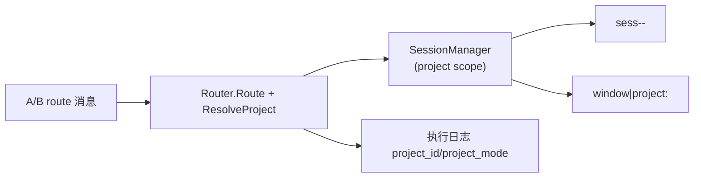
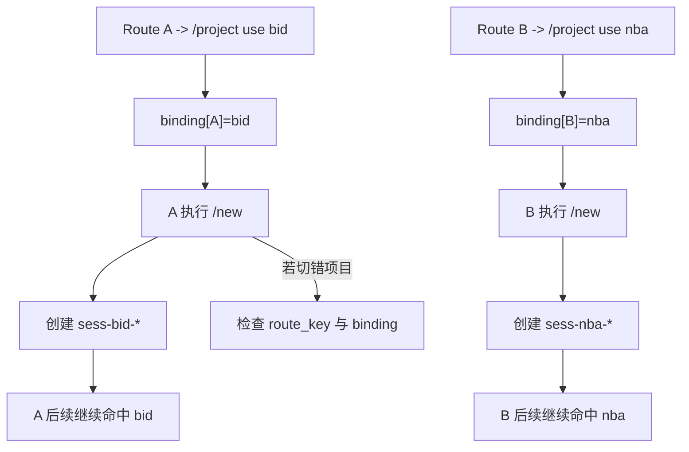
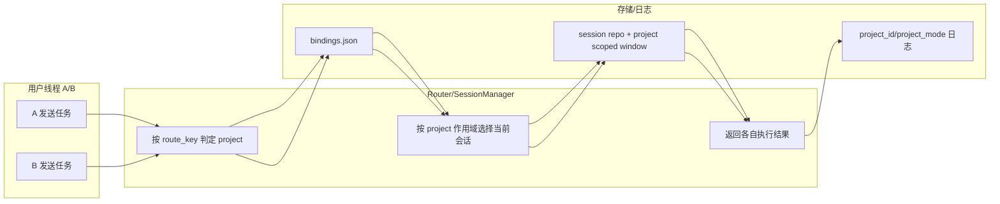

# Use Case US2：同一 Bot 并发多项目隔离（版本：v1.0）

## 1. 功能背景与目标
- 结论：US2 保证不同 route key 在同一 bot 下可以并发处理不同项目且不串会话。
- 目标：会话键必须包含 `project_id`，`/new` 只新建当前项目会话。

## 2. 角色与适用范围
- 角色：研发、QA。
- 场景：A/B 两个线程分别绑定不同项目并同时执行任务。
- 不覆盖：意图建议切换与治理命令。

## 3. 整体架构与模块关系



## 4. 核心流程



## 5. 跨角色协作流程



## 6. 前置条件与依赖
- 已完成 US1：至少创建 `bid` 与 `nba` 两个项目。
- 渠道归一化可稳定生成 thread 级 route key。
- 会话存储可用（内存或文件）。

## 7. 操作步骤（按场景拆分）

### 7.1 页面操作步骤
1. 动作：在线程 A 执行 `/project use bid`，在线程 B 执行 `/project use nba`。
   - 命令/入口：两个不同 thread/channel 窗口。
   - 预期结果：分别返回切换成功。
   - 失败处理：确认 A/B 的 route key 不同（thread_id 不同）。
2. 动作：A/B 各执行一次 `/new`，然后发送普通任务。
   - 命令/入口：A/B 各自窗口。
   - 预期结果：A 会话前缀 `sess-bid-`，B 会话前缀 `sess-nba-`。
   - 失败处理：若相同 session，检查 `session_manager_create.go` 的 project 作用域拼接。

### 7.2 接口调用步骤
1. 动作：调用健康接口确认服务稳定（并发压测前）。
   - 命令/入口：

```bash
curl -sS http://127.0.0.1:8080/healthz
```

   - 预期结果：HTTP 200。
   - 失败处理：若失败，先恢复服务再执行并发验收。

### 7.3 本地命令步骤
1. 动作：运行 US2 集成测试。
   - 命令/入口：

```bash
GOCACHE=$(pwd)/.gocache GOMODCACHE=$(pwd)/.gomodcache \
  go test ./tests/integration -run 'TestProject(RouteIsolation|NewSemantics)'
```

   - 预期结果：两条测试通过。
   - 失败处理：检查 `route_key`、`project_id` 和会话键构造。

## 8. 预期结果与验收标准
- route A/B 并发请求不会共享 session。
- `/new` 不会更改 route 绑定。
- 执行日志能看到正确的 `project_id` 与 `project_mode`。

## 9. 代码实现映射

| 文档步骤 | 代码位置 | 说明 |
|---|---|---|
| route 决策 | `internal/application/service/router.go` | 决策前注入项目信息 |
| /new 控制语义 | `internal/application/service/router_control_flow.go` | `/new` 使用当前 project scope |
| 会话键 project 维度 | `internal/application/service/session_manager_create.go` | `sess-<project>-*` |
| 继续会话 project 透传 | `internal/application/service/session_manager_continue.go` | 续用时不丢 project |
| 日志观测字段 | `cmd/clawx/main.go` | execute begin/done 日志 |
| US2 测试 | `tests/integration/project_route_isolation_test.go` | 跨 route 并发隔离 |
| US2 测试 | `tests/integration/project_new_semantics_test.go` | `/new` 不切项目 |

## 10. 常见问题与排障
- Q：两个线程仍然落到同一项目。
  - 排查命令：`cat ~/.clawx/projects/bindings.json`
  - 修复建议：确认 thread_id 是否进入 route key，并重新绑定。
- Q：`/new` 后项目被改写。
  - 排查命令：在同 route 执行 `/project current` 前后对比。
  - 修复建议：检查是否误执行了 `/project use` 或 `/project confirm`。

## 11. 回滚与风险控制
- 回滚步骤：对所有 route 执行 `unbind`，只保留 `main` fallback。
- 风险控制：并发场景先在测试环境验证 `TestProjectRouteIsolation` 再上线。

## 12. 变更记录
- 版本：v1.0
- 日期：2026-03-14
- 责任人：Codex
- 变更内容：US2 并发隔离指导首版。
