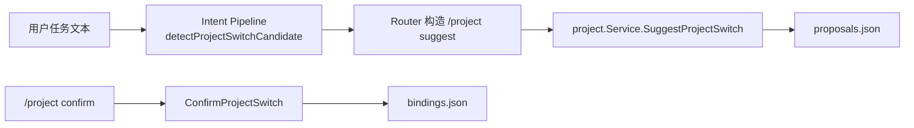
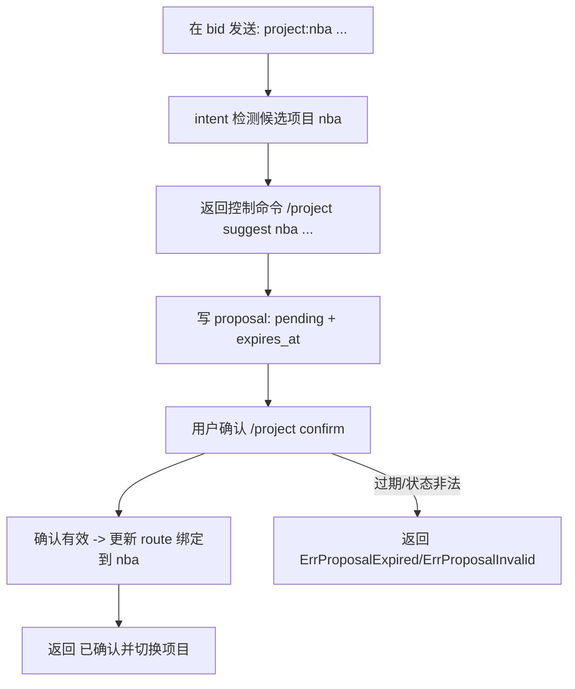
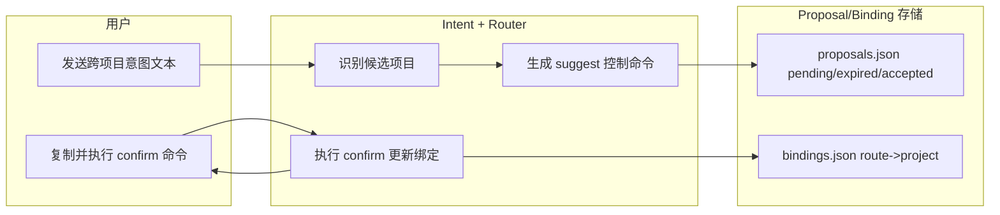

# Use Case US3：意图辅助切换（Confirm-First）（版本：v1.0）

## 1. 功能背景与目标
- 结论：US3 不做静默自动切换，只做建议并要求确认。
- 目标：降低意图误判造成的跨项目上下文污染。

## 2. 角色与适用范围
- 角色：研发、QA、bot 使用者。
- 场景：当前在项目 A，消息明显指向项目 B。
- 不覆盖：项目删除与修复治理。

## 3. 整体架构与模块关系



## 4. 核心流程



## 5. 跨角色协作流程



## 6. 前置条件与依赖
- 已创建目标项目（如 `nba`）。
- 当前 route 已绑定到另一个项目（如 `bid`）。
- `proposalTTL` 默认 10 分钟（`cmd/clawx/project.go` 注入）。

## 7. 操作步骤（按场景拆分）

### 7.1 页面操作步骤
1. 动作：在当前 `bid` route 发送 `请处理 project:nba 的待办`。
   - 命令/入口：渠道窗口自然语言消息。
   - 预期结果：系统返回建议消息，包含 `/project confirm <proposal_id>`。
   - 失败处理：若未建议，检查文本是否包含 `project:<id>` 或 `切换到 <id>`。
2. 动作：执行 `/project confirm <proposal_id>`。
   - 命令/入口：同一路由窗口。
   - 预期结果：返回 `已确认并切换项目: nba`。
   - 失败处理：若过期，重新发送意图触发新 proposal。
3. 动作：执行 `/project current`。
   - 命令/入口：同一路由窗口。
   - 预期结果：显示 `当前项目: nba [active]`。
   - 失败处理：检查 proposal 状态与绑定写入。

### 7.2 接口调用步骤
1. 动作：确认服务可响应（用于排除环境故障）。
   - 命令/入口：

```bash
curl -sS http://127.0.0.1:8080/healthz
```

   - 预期结果：HTTP 200。
   - 失败处理：先恢复服务，再复现意图链路。

### 7.3 本地命令步骤
1. 动作：运行 US3 集成测试。
   - 命令/入口：

```bash
GOCACHE=$(pwd)/.gocache GOMODCACHE=$(pwd)/.gomodcache \
  go test ./tests/integration -run 'TestProjectSwitch(Confirm|ProposalExpire)'
```

   - 预期结果：确认与过期两条路径都通过。
   - 失败处理：检查 `service_proposal.go` 状态机和 TTL。

## 8. 预期结果与验收标准
- 系统只建议切换，不自动切换。
- confirm 在有效期内生效，超时后失败。
- proposal 状态可追踪（pending/accepted/expired）。

## 9. 代码实现映射

| 文档步骤 | 代码位置 | 说明 |
|---|---|---|
| 意图识别候选项目 | `internal/application/intent/pipeline.go` | `detectProjectSwitchCandidate` |
| suggest 命令拼装 | `internal/application/service/router.go` | `buildProjectSuggestCommand` |
| suggest/confirm 控制流 | `internal/application/service/router_control_flow.go` | project suggest/confirm 分支 |
| proposal 持久化与确认 | `internal/application/project/service_proposal.go` | 建议、确认、过期校验 |
| proposal GC | `internal/application/project/proposal_gc.go` | 定时过期回收 |
| US3 测试 | `tests/integration/project_switch_confirm_test.go` | confirm 生效 |
| US3 测试 | `tests/integration/project_switch_proposal_expire_test.go` | 过期失败 |

## 10. 常见问题与排障
- Q：消息未触发建议切换。
  - 排查命令：检查文本是否包含 `project:nba` 或 `切换到 nba`。
  - 修复建议：使用显式提示格式，或直接执行 `/project use nba`。
- Q：confirm 报 proposal invalid。
  - 排查命令：`cat ~/.clawx/projects/proposals.json`
  - 修复建议：确认 proposal 是否已 accepted/expired，必要时重新触发。

## 11. 回滚与风险控制
- 回滚步骤：临时禁用建议链路可通过避免发送项目提示词，并改为人工 `/project use`。
- 风险控制：生产建议文案保持 confirm-first，不要改成自动切换。

## 12. 变更记录
- 版本：v1.0
- 日期：2026-03-14
- 责任人：Codex
- 变更内容：US3 意图辅助切换指导首版。
