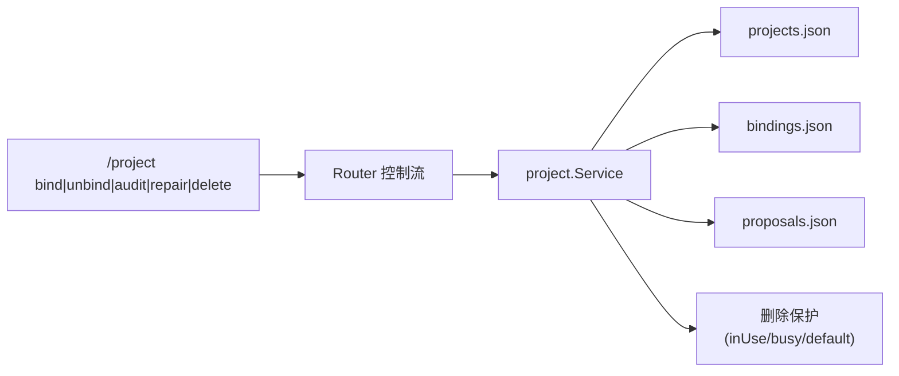
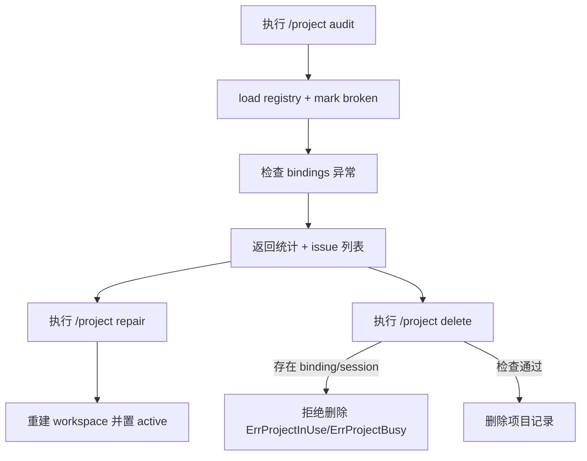
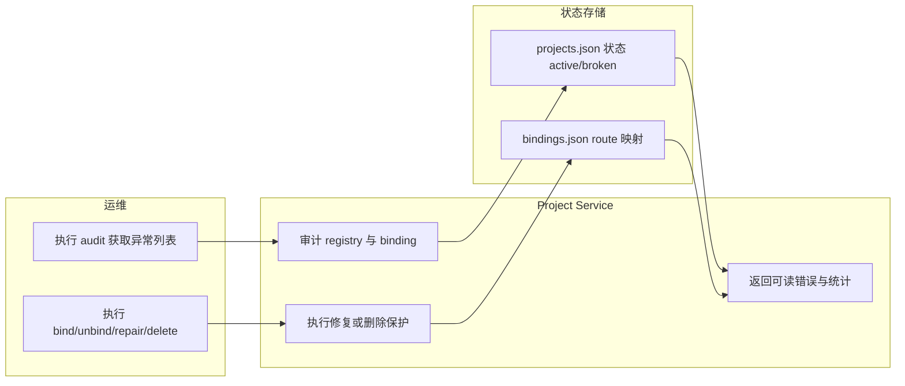

# Use Case US4：可观测与恢复（版本：v1.0）

## 1. 功能背景与目标
- 结论：US4 解决“多项目状态文件损坏/脏绑定/误删风险”带来的运维不可控问题。
- 目标：提供 `bind/unbind/audit/repair/delete` 的治理闭环。

## 2. 角色与适用范围
- 角色：运维、研发、QA。
- 场景：修复绑定、识别 broken 项目、安全删除项目。
- 不覆盖：意图识别算法调优。

## 3. 整体架构与模块关系



## 4. 核心流程



## 5. 跨角色协作流程



## 6. 前置条件与依赖
- `projects/*.json` 文件存在并可读写。
- 目标项目已创建。
- 执行删除前应确认默认项目不是目标项目。

## 7. 操作步骤（按场景拆分）

### 7.1 页面操作步骤
1. 动作：执行 `/project audit`。
   - 命令/入口：任一具备控制权限的窗口。
   - 预期结果：返回 `projects/active/broken/bindings/broken_bindings` 统计。
   - 失败处理：若报错，优先检查 `projects.json` 是否损坏。
2. 动作：执行 `/project bind <route_key> bid` 或 `/project unbind <route_key>`。
   - 命令/入口：同窗口。
   - 预期结果：绑定/解绑成功文案返回。
   - 失败处理：若目标项目不存在，先 create 或修复项目。
3. 动作：执行 `/project repair bid`。
   - 命令/入口：同窗口。
   - 预期结果：返回 `已修复项目: bid [active]`。
   - 失败处理：若路径为空或无权限，检查 workspaceRoot 与目录权限。
4. 动作：执行 `/project delete bid`。
   - 命令/入口：同窗口。
   - 预期结果：有绑定或会话时拒绝，满足条件后删除成功。
   - 失败处理：先 unbind 并确保无活动会话；必要时 `--force`。

### 7.2 接口调用步骤
1. 动作：检查服务可用（排除非业务故障）。
   - 命令/入口：

```bash
curl -sS http://127.0.0.1:8080/healthz
```

   - 预期结果：HTTP 200。
   - 失败处理：先恢复进程，再执行治理命令。

### 7.3 本地命令步骤
1. 动作：运行 US4 集成测试。
   - 命令/入口：

```bash
GOCACHE=$(pwd)/.gocache GOMODCACHE=$(pwd)/.gomodcache \
  go test ./tests/integration -run 'TestProject(BindingRepairCommands|RegistryBrokenStateDetection|DeleteGuard)'
```

   - 预期结果：治理相关测试通过。
   - 失败处理：查看 `service_audit.go`、`service_delete.go`、`service_repair.go`。

## 8. 预期结果与验收标准
- `audit` 能准确报告 broken 项目和异常绑定。
- `bind/unbind` 可恢复 route 与项目映射。
- `repair` 能将 broken 项目恢复为 active。
- `delete` 默认受保护，避免误删活跃项目。

## 9. 代码实现映射

| 文档步骤 | 代码位置 | 说明 |
|---|---|---|
| bind/unbind | `internal/application/project/service_bind.go` | route 修复入口 |
| audit | `internal/application/project/service_audit.go` | 统计与异常明细 |
| delete 保护 | `internal/application/project/service_delete.go` | default/in_use/busy 保护 |
| repair | `internal/application/project/service_repair.go` | workspace 重建 |
| broken 标记 | `internal/application/project/service.go` | 缺失目录自动标记 broken |
| 控制命令输出 | `internal/application/service/router_control_flow.go` | 审计/修复/删除响应 |
| US4 测试 | `tests/integration/project_binding_repair_test.go` | bind/unbind 回归 |
| US4 测试 | `tests/integration/project_registry_broken_state_test.go` | broken 检测 |
| US4 测试 | `tests/integration/project_delete_guard_test.go` | 删除保护 |

## 10. 常见问题与排障
- Q：`audit` 不显示预期异常。
  - 排查命令：`cat ~/.clawx/projects/projects.json && cat ~/.clawx/projects/bindings.json`
  - 修复建议：确认 route_key 与 project_id 是否一致、workspace 是否存在。
- Q：`delete` 一直失败。
  - 排查命令：先执行 `/project unbind <route_key>`，再重试 delete。
  - 修复建议：若仍失败，检查是否有活动会话（busy）。

## 11. 回滚与风险控制
- 回滚步骤：
  1. 停止危险删除操作。
  2. 备份 `~/.clawx/projects/*.json`。
  3. 将关键 route 统一绑定回 `main`。
- 风险控制：
  - 生产删除项目必须先过 audit。
  - `--force` 仅用于人工确认后的恢复场景。

## 12. 变更记录
- 版本：v1.0
- 日期：2026-03-14
- 责任人：Codex
- 变更内容：US4 可观测与恢复指导首版。
