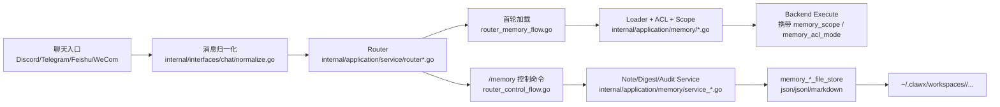
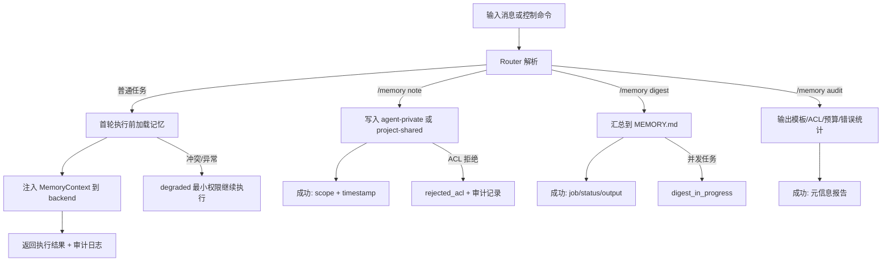
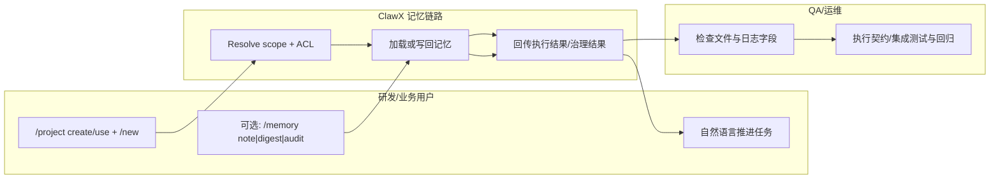

# 006-memory-context-layer 功能使用指导（总览）（版本：v2.0）

## 1. 功能背景与目标

### 1.1 为什么要做
- 结论：006 的核心不是“让你每轮都执行 `/memory`”，而是让记忆能力在项目与会话边界内可控、可审计、可恢复。
- 业务背景：ClawX 已有 `route -> window -> session -> project` 隔离，但长期记忆还缺少工程化治理。
- 当前痛点：
  - 同项目多 Agent 并发时，存在私有记忆串读风险。
  - 主会话与共享会话边界不清晰时，可能误载入私有长期记忆。
  - 缺少显式写回与审计命令时，记忆难以维护和排障。
- 目标收益：
  - 项目创建后自动具备记忆骨架并支持首轮加载。
  - 主/共享 ACL 清晰，默认最小权限。
  - `/memory note|digest|audit` 作为可选治理工具，而不是开发主流程前置。

### 1.2 本文解决什么问题
- 面向角色：研发 / QA / 运维。
- 本文范围：US1~US4 的功能总览、依赖、验收总则、用例索引。
- 非本文范围：向量检索、跨节点同步、外部数据库记忆服务。

## 2. 角色与适用范围
- 研发：按“项目命令 + 自然语言任务”主流程开发；需要时显式治理记忆。
- QA：对 US1~US4 独立验收，重点验证 ACL 与控制命令语义不回归。
- 运维：关注配置项、日志可观测字段、回滚策略与风险控制。
- 适用环境：`006-memory-context-layer` 分支，Go 1.23，本地文件存储（`~/.clawx/workspaces`）。

## 3. 整体架构与模块关系



- 路由编排：`router_session_flow.go`、`router_memory_flow.go`、`router_control_flow.go`。
- 记忆能力：`scope_resolver.go`、`session_classifier.go`、`loader*.go`、`service_*.go`。
- 持久化：`internal/infrastructure/persistence/memory_*_file_store.go`。

## 4. 核心流程



## 5. 跨角色协作流程



## 6. 前置条件与依赖
- 配置文件：`config.json`（或环境变量覆盖）可加载。
- 关键配置：
  - `memory.ownerAllowlist`
  - `memory.tokenBudget`（默认 `4096`）
  - `memory.autoDigestEnabled`（默认 `false`）
- 环境变量覆盖：
  - `CLAWX_MEMORY_OWNER_ALLOWLIST`
  - `CLAWX_MEMORY_TOKEN_BUDGET`
  - `CLAWX_MEMORY_AUTO_DIGEST`
- 权限：运行用户需可读写 `~/.clawx/workspaces`。

## 7. 操作步骤（按场景拆分）

### 7.1 页面操作步骤
1. 动作：在聊天窗口执行 `/project create image_tools 图片工具`、`/project use image_tools`、`/new`。
   - 命令/入口：任一支持控制命令的聊天窗口。
   - 预期结果：返回创建/切换成功；会话 ID 进入 `sess-image_tools-*` 作用域。
   - 失败处理：若提示项目异常，先执行 `/project current` 和 `/project repair image_tools`。

### 7.2 接口调用步骤
1. 动作：验证服务健康状态。
   - 命令/入口：

```bash
curl -sS http://127.0.0.1:8080/healthz
```

   - 预期结果：返回 `ok`。
   - 响应片段示例：

```text
HTTP/1.1 200 OK
ok
```

   - 失败处理：确认 `go run ./cmd/clawx serve` 已启动及端口未冲突。

### 7.3 本地命令步骤
1. 动作：运行 006 核心回归测试。
   - 命令/入口：

```bash
GOCACHE=$(pwd)/.gocache GOMODCACHE=$(pwd)/.gomodcache \
  go test ./tests/integration -run 'TestMemory(FirstTurnLoad|AgentIsolation|SharedACL|CommandsFlow|ControlNewRegression|ControlResumeSwitchRegression|ControlListCurrentCancelRegression)'
```

   - 预期结果：核心链路与控制命令语义回归全部通过。
   - 失败处理：按失败用例回到对应 Use Case 文档逐项定位。

### 7.4 Use Case 文档索引

| 文档 | 适用角色 | 独立验收口径 |
|---|---|---|
| `usecase-us1-project-bootstrap-first-load.md` | 研发 / QA | 项目创建后自动生成记忆骨架，首轮执行前加载记忆 |
| `usecase-us2-agent-isolation.md` | 研发 / QA / 运维 | 同项目多 Agent 并发不串读私有记忆 |
| `usecase-us3-main-shared-acl.md` | QA / 运维 | 主会话可读私有长期层，共享会话强制跳过 |
| `usecase-us4-memory-governance-image-tool.md` | 研发 / QA | `note/digest/audit` 治理闭环 + 图片工具长图拼接实战 |

## 8. 预期结果与验收标准
- FR 对齐：FR-001 ~ FR-020 在现有测试集中可追踪。
- 主路径验收：
  - 不执行 `/memory` 也可持续完成开发任务。
  - `/memory` 仅在需要沉淀、汇总、审计时执行。
- 安全验收：
  - 共享会话不加载长期私有层。
  - ACL 冲突降级为最小权限并保留审计证据。

## 9. 代码实现映射

| 文档步骤 | 代码位置 | 说明 |
|---|---|---|
| `/memory` 语法解析 | `internal/application/command/memory_command.go` | `note|digest|audit` 与 `--shared` 解析 |
| 控制命令分流 | `internal/application/service/router_control_flow.go` | `/memory` 与 `/project`、`/new` 共存 |
| 会话执行主链路 | `internal/application/service/router_session_flow.go` | 执行前注入 memory context |
| 首轮加载审计 | `internal/application/service/router_memory_flow.go` | 输出 `memory_load_audit` 字段 |
| 作用域/ACL 判定 | `internal/application/memory/scope_resolver.go`、`session_classifier.go`、`loader_acl.go` | 主/共享与降级策略 |
| 记忆写回服务 | `internal/application/memory/service_note.go`、`service_digest.go`、`service_audit.go` | note/digest/audit 行为 |
| 记忆存储实现 | `internal/infrastructure/persistence/memory_*_file_store.go` | 模板、日记、审计、digest 持久化 |
| 运行时装配 | `cmd/clawx/memory.go` | CommandService 依赖注入 |

## 10. 常见问题与排障

### Q0：回复里 `[Agent Direct]` 是什么意思？
- 含义：这是系统输出来源标签，表示该回复由主 Agent 直接生成。
- 对照关系：
  - `[Agent Direct]`：主 Agent 直接回复
  - `[ClawX Skill]`：命中并执行了 Skill 路径
- 作用：便于你区分“普通执行结果”和“技能执行结果”，不影响命令语义本身。

### Q1：为什么不建议每轮都 `/memory note`？
- 结论：这会把治理动作误当成主流程，增加噪音和维护成本。
- 正确做法：主流程继续自然语言开发；里程碑节点再 note/digest。

### Q2：`/memory note --shared` 返回 `rejected_acl`
- 原因：当前会话不是 owner 主会话，或已进入降级模式。
- 排查：检查 route 是否 direct、owner 是否在 allowlist、审计日志拒绝原因。

### Q3：如何确认加载真的发生？
- 检索日志关键字：`memory_load_audit:`、`memory_loaded_files=`、`memory_denied_files=`、`memory_acl_mode=`。

### Q4：可以只用自然语言让它实现新命令吗？
- 可以。实现类需求建议用自然语言先定义“目标命令 + 数据模型 + 验收测试”。
- 推荐模板（可直接发送）：

```text
请在当前项目实现一套 /image 控制命令：
1) /image new [name]
2) /image add <path...>
3) /image build
4) /image list
5) /image use <collection_id>
6) /image reset

实现要求：
- collection 级隔离，按 project + route 维护当前激活集合；
- 落盘到 ~/.clawx/workspaces/<project_id>/.image/collections/<collection_id>/；
- build 规则：按输入顺序、最大宽度、窄图居中补白、输出 png；
- 补齐契约测试和集成测试；
- 先给我实现计划，再按步骤提交改动和测试结果。
```

## 11. 回滚与风险控制
- 回滚策略：
  1. 暂停共享写回（不执行 `/memory note --shared`）。
  2. 清空 `memory.ownerAllowlist`，阻断私有长期层访问。
  3. 保留 `/project` + `/new` + 自然语言开发主路径。
- 风险控制：
  - 任何发布前必须跑一条契约测试和一条集成回归测试。
  - 不在共享会话写入/加载敏感长期记忆。

## 12. 变更记录
- 版本：v2.0
- 日期：2026-03-16
- 责任人：Codex
- 变更内容：按 feature-guide 规范重构总览文档，并拆分 Use Case 索引。
