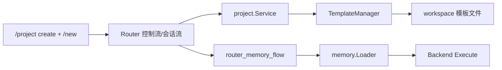
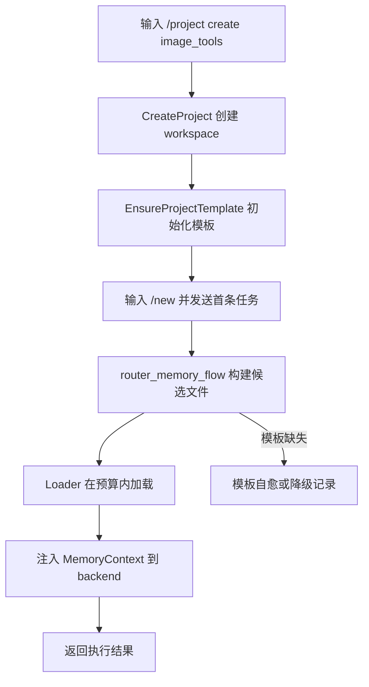
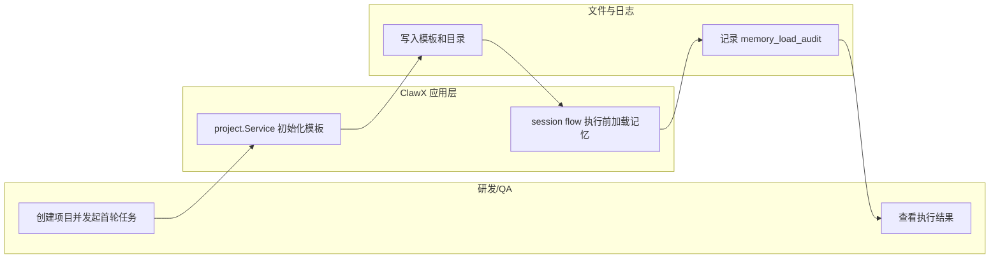

# Use Case US1：项目记忆骨架与首轮加载（版本：v1.0）

## 1. 功能背景与目标
- 结论：US1 保证“新项目创建后马上可用记忆骨架，首轮执行前自动加载”。
- 目标：
  - `/project create` 后自动补齐模板文件。
  - `/new` 后首轮执行前加载分层记忆。
  - 骨架缺失时可自愈。

## 2. 角色与适用范围
- 角色：研发、QA。
- 适用范围：单项目单 Agent 的初始化与首轮加载。
- 不覆盖：多 Agent 隔离、主/共享 ACL 细节、写回治理命令、复杂服务编排。

## 3. 整体架构与模块关系



## 4. 核心流程



## 5. 跨角色协作流程



## 6. 前置条件与依赖
- `projects.workspaceRoot` 配置正确且可写。
- `memory.tokenBudget > 0`（默认 4096）。
- 服务已启动：`go run ./cmd/clawx serve`。

## 7. 操作步骤（按场景拆分）

### 7.1 页面操作步骤
1. 动作：创建并切换项目。
   - 命令/入口：聊天窗口输入 `/project create image_tools 图片工具项目`、`/project use image_tools`。
   - 预期结果：返回“已创建项目”“已切换当前项目”。
   - 失败处理：若提示项目已存在，执行 `/project list` 确认状态。
2. 动作：创建会话并发送首条开发任务。
   - 命令/入口：输入 `/new` 后发送“实现图片拼接命令骨架”。
   - 预期结果：会话创建成功并返回首条执行结果。
   - 失败处理：若首轮失败，检查日志 `memory_load_audit` 与项目目录模板是否存在。

### 7.4 自然语言驱动服务启动与状态确认（当前项目）
1. 动作：用自然语言触发“启动服务”。
   - 推荐话术（可直接发给 Bot）：
     - `请在当前项目启动图片工具服务`
   - 预期结果：系统自动映射为 `/service start image-tool -- go run ./cmd/imagectl`，并返回 `服务已启动: image-tool pid=... cwd=... log=...`。
2. 动作：确认服务状态。
   - 推荐话术：
     - `帮我看下图片工具服务状态`
   - 预期结果：系统自动映射为 `/service status image-tool`，返回 `服务状态:`，并包含 `image-tool [running] pid=...`。
3. 动作：查看运行日志（验证服务确实执行）。
   - 推荐话术：
     - `查看图片工具服务日志`
   - 预期结果：系统自动映射为 `/service logs image-tool --tail=50`，返回日志路径与最近输出内容。
4. 动作：停止服务。
   - 推荐话术：
     - `停掉图片工具服务`
   - 预期结果：系统自动映射为 `/service stop image-tool`，返回 `服务已停止: image-tool`。
5. 兜底说明：若你希望完全可控，也可显式输入 `/service` 命令。

### 7.2 接口调用步骤
1. 动作：检查服务健康，排除运行时故障。
   - 命令/入口：

```bash
curl -sS http://127.0.0.1:8080/healthz
```

   - 预期结果：`ok`。
   - 失败处理：确认服务进程与监听地址配置。

### 7.3 本地命令步骤
1. 动作：验证 US1 关键测试。
   - 命令/入口：

```bash
GOCACHE=$(pwd)/.gocache GOMODCACHE=$(pwd)/.gomodcache \
  go test ./tests/integration -run 'TestMemory(ProjectBootstrap|FirstTurnLoad)'
```

   - 预期结果：两条集成测试通过。
   - 失败处理：查看 `service_create.go`、`template_manager.go`、`router_memory_flow.go`。

## 8. 预期结果与验收标准
- 新项目目录自动具备基础模板文件与 memory 子目录。
- 首轮执行前加载行为可观测，且不阻断主流程。
- 缺失模板可被修复或至少能被审计发现。
- 可通过自然语言+`/service` 指令在当前项目中启动/查询/停止工具服务。

## 9. 代码实现映射

| 文档步骤 | 代码位置 | 说明 |
|---|---|---|
| 项目创建触发模板初始化 | `internal/application/project/service_create.go` | `ensureMemoryTemplate` |
| 项目修复触发模板自愈 | `internal/application/project/service_repair.go` | `ensureMemoryTemplate` |
| 模板与漂移管理 | `internal/application/memory/template_manager.go` | manifest 与缺失补齐 |
| 首轮加载注入 | `internal/application/service/router_memory_flow.go` | 加载候选并记录审计 |
| 会话执行主链路 | `internal/application/service/router_session_flow.go` | execute 前注入 memory context |
| 服务控制命令解析 | `internal/application/command/service_command.go` | 解析 `/service start|stop|status|logs` |
| 服务控制流分发 | `internal/application/service/router_control_flow.go` | 处理 `/service` 命令并按 project+agent 隔离 |
| 服务运行时实现 | `internal/application/managedservice/service.go` | 启停进程、状态、日志、元数据落盘 |
| US1 集成测试 | `tests/integration/memory_project_bootstrap_test.go` | 骨架初始化 |
| US1 集成测试 | `tests/integration/memory_first_turn_load_test.go` | 首轮加载 |

## 10. 常见问题与排障
- Q1：项目创建后没有模板文件。
  - 排查命令：`ls -la ~/.clawx/workspaces/image_tools`
  - 修复建议：执行 `/project repair image_tools` 后重试。
- Q2：首轮没有加载记忆。
  - 排查命令：检索 `memory_load_audit:` 日志。
  - 修复建议：确认项目目录存在且 `memory.tokenBudget` 非 0。
- Q3：自然语言说“启动服务”但没有真正启动。
  - 排查命令：`/service status`。
  - 修复建议：优先使用“图片工具服务”关键词；或显式输入 `/service start <name> -- <cmd...>`。
- Q4：状态是 running 但不确定输出是否正常。
  - 排查命令：`/service logs <name> --tail=100`。
  - 修复建议：检查日志路径和命令参数，必要时先 `/service stop <name>` 再重新 start。

## 11. 回滚与风险控制
- 回滚：暂时只保留项目与会话能力，不依赖记忆加载内容。
- 风险控制：模板文件只增不删；异常时降级执行，不中断主流程。

## 12. 变更记录
- 版本：v1.1
- 日期：2026-03-17
- 责任人：Codex
- 变更内容：补充“自然语言驱动服务启动/状态确认”操作与 `/service` 控制链路映射。
