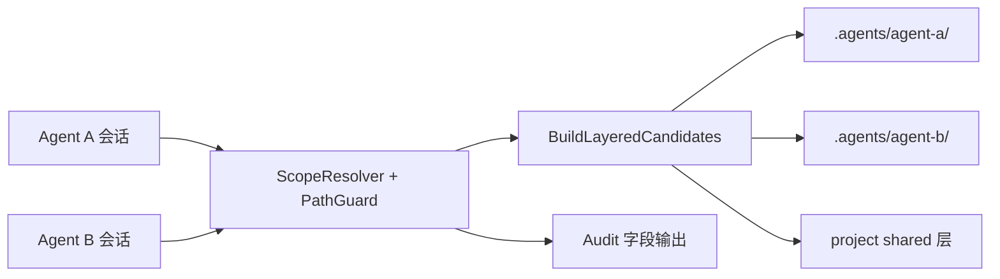
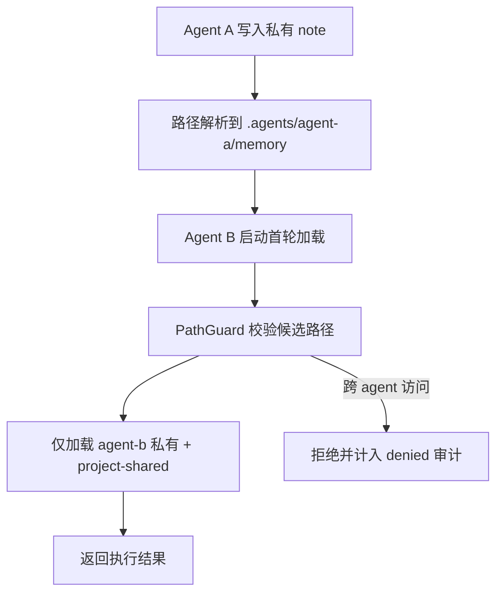
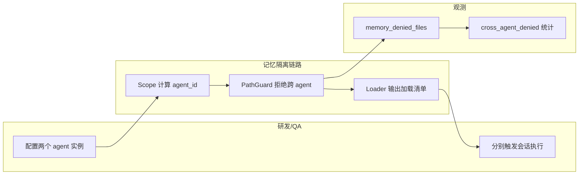

# Use Case US2：同项目多 Agent 记忆隔离（版本：v1.0）

## 1. 功能背景与目标
- 结论：US2 解决“同项目多 Agent 并发时私有记忆串读”问题。
- 目标：
  - Agent 私有记忆路径按 `.agents/<agent_id>/` 隔离。
  - 同项目只共享 project 层，不共享 agent-private 层。
  - 私有目录缺失时自动补齐。

## 2. 角色与适用范围
- 角色：研发、QA、运维。
- 适用范围：同项目多 Agent 并发加载/写回场景。
- 不覆盖：主/共享会话 ACL 差异（见 US3）。

## 3. 整体架构与模块关系



## 4. 核心流程



## 5. 跨角色协作流程



## 6. 前置条件与依赖
- 至少两个可区分 agent（实例绑定或测试运行时配置）。
- 项目已创建并可切换。
- `~/.clawx/workspaces/<project>/.agents/` 可读写。

## 7. 操作步骤（按场景拆分）

### 7.1 页面操作步骤
1. 动作：Agent A 在项目 `memo` 下执行 `/memory note A-only`。
   - 命令/入口：Agent A 所在窗口。
   - 预期结果：返回 `scope=agent-private`。
   - 失败处理：若失败，检查当前 route 是否已绑定项目 `memo`。
2. 动作：Agent B 在同项目创建新会话并执行任务。
   - 命令/入口：Agent B 所在窗口执行 `/new` 后发送任务文本。
   - 预期结果：任务可执行，但不读取 A 的私有记忆。
   - 失败处理：若出现串读迹象，立即检查审计字段与 `.agents` 目录结构。

### 7.2 接口调用步骤
1. 动作：查询健康状态，确认非服务故障。
   - 命令/入口：

```bash
curl -sS http://127.0.0.1:8080/healthz
```

   - 预期结果：`ok`。
   - 失败处理：先恢复服务再做隔离验证。

### 7.3 本地命令步骤
1. 动作：执行 US2 隔离相关测试。
   - 命令/入口：

```bash
GOCACHE=$(pwd)/.gocache GOMODCACHE=$(pwd)/.gomodcache \
  go test ./tests/integration -run 'TestMemory(AgentIsolation|AgentBootstrap|CrossProjectIsolation)'
```

   - 预期结果：隔离与自愈测试通过。
   - 失败处理：重点排查 `path_guard.go`、`loader_layers.go`。

## 8. 预期结果与验收标准
- Agent A/B 只能读取各自私有层。
- project-shared 层可被同项目所有 agent 共享读取。
- 私有目录缺失可自动补齐后继续执行。

## 9. 代码实现映射

| 文档步骤 | 代码位置 | 说明 |
|---|---|---|
| 作用域解析 | `internal/application/memory/scope_resolver.go` | 形成 `agent+project+route` scope |
| 跨 agent 路径防护 | `internal/application/memory/path_guard.go` | `ErrCrossAgentAccess` 防护 |
| 分层候选构建 | `internal/application/memory/loader_layers.go` | agent-private 优先 |
| 默认私有写回 | `internal/application/memory/write_policy.go` | note 默认落私有层 |
| 审计字段构建 | `internal/application/memory/audit.go` | denied/error 统计 |
| US2 集成测试 | `tests/integration/memory_agent_isolation_test.go` | 私有隔离 |
| US2 集成测试 | `tests/integration/memory_agent_bootstrap_test.go` | 私有目录自愈 |
| US2 契约测试 | `tests/contract/memory_agent_acl_contract_test.go` | 跨 agent 拒绝 |

## 10. 常见问题与排障
- Q1：B 似乎读到了 A 的内容。
  - 排查命令：检查日志 `memory_denied_files=` 与 `cross_agent_denied`。
  - 修复建议：确认 `agent_id` 真实来源与实例绑定没有混用。
- Q2：`.agents/<agent_id>` 目录没有自动创建。
  - 排查命令：`ls -la ~/.clawx/workspaces/<project>/.agents`
  - 修复建议：重新触发会话执行，检查进程是否有目录写权限。

## 11. 回滚与风险控制
- 回滚：暂停多 Agent 并发场景，先固定单 Agent 运行。
- 风险控制：任何 agent 私有目录异常都应走自动补齐，不手工跨目录拷贝私有记忆。

## 12. 变更记录
- 版本：v1.0
- 日期：2026-03-16
- 责任人：Codex
- 变更内容：新增 US2 独立验收指导。
