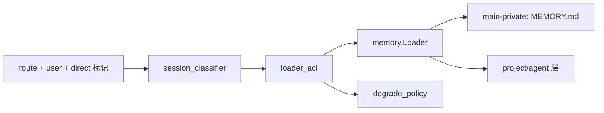
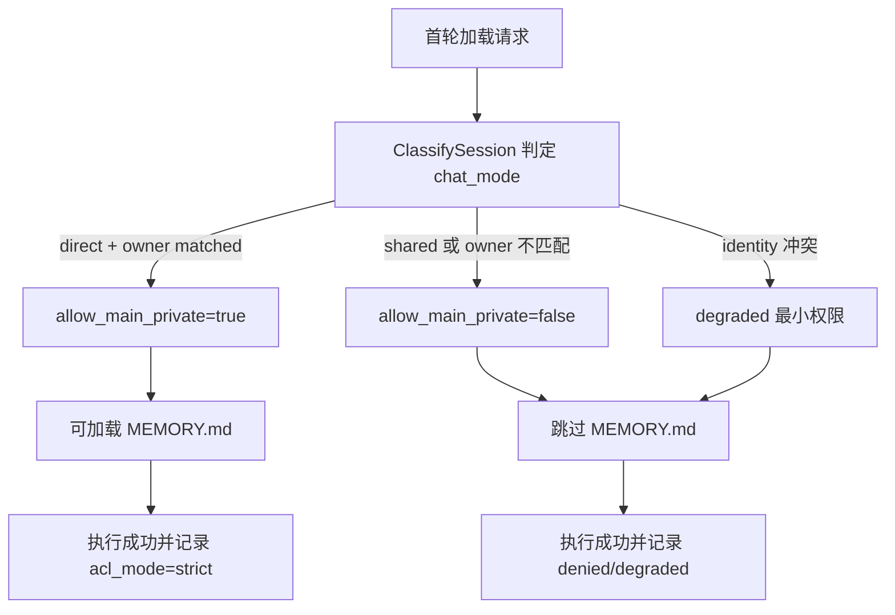
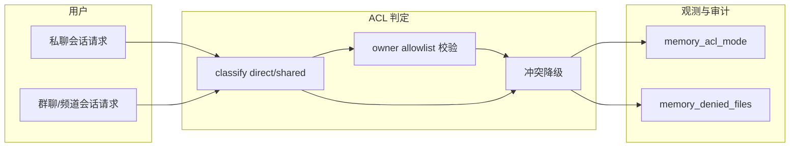

# Use Case US3：主会话与共享会话 ACL（版本：v1.0）

## 1. 功能背景与目标
- 结论：US3 保证长期私有记忆只在主会话可见，共享会话默认不可见。
- 目标：
  - 主会话（direct + owner allowlist）可访问 main-private。
  - 共享会话强制跳过 `MEMORY.md`。
  - 判定冲突时降级为最小权限并可审计。

## 2. 角色与适用范围
- 角色：QA、运维、研发。
- 适用范围：主/共享会话 ACL 判定与降级行为。
- 不覆盖：多 Agent 隔离（见 US2）、写回治理命令细节（见 US4）。

## 3. 整体架构与模块关系



## 4. 核心流程



## 5. 跨角色协作流程



## 6. 前置条件与依赖
- `memory.ownerAllowlist` 已配置 owner 标识。
- route key 可区分 direct / shared 语义。
- 测试或现场日志可访问。

## 7. 操作步骤（按场景拆分）

### 7.1 页面操作步骤
1. 动作：在 owner 私聊（direct）会话触发一次首轮执行。
   - 命令/入口：私聊窗口执行 `/new` 后发送任务。
   - 预期结果：可加载主会话长期私有层（条件满足时）。
   - 失败处理：若未加载，检查 owner 是否在 allowlist。
2. 动作：在共享会话（群聊/频道）触发同样执行。
   - 命令/入口：共享窗口执行 `/new` 后发送任务。
   - 预期结果：强制跳过 `MEMORY.md`。
   - 失败处理：若误加载主私有层，立即阻断发布并回归 ACL 测试。

### 7.2 接口调用步骤
1. 动作：检查健康状态。
   - 命令/入口：

```bash
curl -sS http://127.0.0.1:8080/healthz
```

   - 预期结果：`ok`。
   - 失败处理：先恢复服务再验证 ACL 行为。

### 7.3 本地命令步骤
1. 动作：执行 ACL 与降级测试。
   - 命令/入口：

```bash
GOCACHE=$(pwd)/.gocache GOMODCACHE=$(pwd)/.gomodcache \
  go test ./tests/integration -run 'TestMemory(SharedACL|ACLConflictFallsBackToDegraded)'
```

   - 预期结果：共享会话禁读、冲突降级均通过。
   - 失败处理：检查 `session_classifier.go`、`loader_acl.go`、`degrade_policy.go`。

## 8. 预期结果与验收标准
- 共享会话 100% 跳过长期私有层。
- 主会话仅在 owner allowlist 命中时加载长期私有层。
- 冲突场景进入 degraded，主流程继续执行。

## 9. 代码实现映射

| 文档步骤 | 代码位置 | 说明 |
|---|---|---|
| 会话分类 | `internal/application/memory/session_classifier.go` | direct/shared 与 owner 判定 |
| ACL 应用 | `internal/application/memory/loader_acl.go` | `AllowMainPrivate`、`ACLMode` 注入 |
| 降级策略 | `internal/application/memory/degrade_policy.go` | 最小权限退化 |
| 首轮加载日志 | `internal/application/service/router_memory_flow.go` | 输出 `memory_acl_mode` 等字段 |
| 运行时日志落点 | `cmd/clawx/main.go` | execute done 日志字段 |
| US3 单测 | `tests/unit/memory_main_session_acl_test.go` | 主会话判定 |
| US3 集成测试 | `tests/integration/memory_shared_acl_test.go` | 共享会话禁读 |
| US3 集成测试 | `tests/integration/memory_acl_degrade_test.go` | 冲突降级 |

## 10. 常见问题与排障
- Q1：私聊也加载不到长期私有层。
  - 排查：owner 是否在 `memory.ownerAllowlist`；route 是否被识别为 direct。
  - 修复：补充 allowlist 或修正 route 来源。
- Q2：出现 `degraded` 但不清楚原因。
  - 排查：检查 route peer 与 user identity 是否冲突。
  - 修复：统一身份来源，避免 direct route 与 userID 不一致。

## 11. 回滚与风险控制
- 回滚：将 allowlist 置空，统一走 shared 最小权限策略。
- 风险控制：共享场景保持默认 deny，宁可少加载也不泄露。

## 12. 变更记录
- 版本：v1.0
- 日期：2026-03-16
- 责任人：Codex
- 变更内容：新增 US3 独立验收指导。
