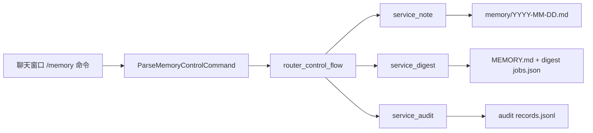
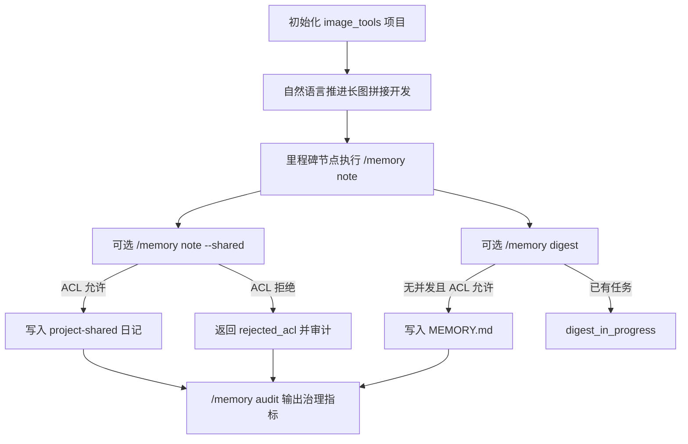
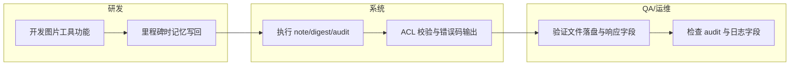

# Use Case US4：记忆写回与治理（图片工具长图拼接实战）（版本：v1.0）

## 1. 功能背景与目标
- 结论：US4 的本质是“可选治理能力”，不是强制对话流程。
- 目标：
  - 用 `/memory note` 显式沉淀阶段结论。
  - 用 `/memory digest` 在 ACL 允许时汇总到长期层。
  - 用 `/memory audit` 做模板/ACL/错误可观测检查。
- 关键澄清：日常开发主流程仍是 `/project` + `/new` + 自然语言任务推进。

## 2. 角色与适用范围
- 角色：研发、QA、运维。
- 适用范围：`note`、`note --shared`、`digest`、`audit` 以及相关 ACL 行为。
- 不覆盖：图片算法实现细节（此处仅用作真实演示场景）。

## 3. 整体架构与模块关系



## 4. 核心流程



## 5. 跨角色协作流程



## 6. 前置条件与依赖
- 项目已创建并切换：`image_tools`。
- 主会话 ACL 需要 `memory.ownerAllowlist` 命中。
- digest 默认手工触发，`memory.autoDigestEnabled` 默认 `false`。

## 7. 操作步骤（按场景拆分）

### 7.1 页面操作步骤（聊天窗口）
1. 动作：初始化项目并进入开发会话。
   - 命令/入口：
     - `/project create image_tools 图片工具`
     - `/project use image_tools`
     - `/new`
   - 预期结果：创建并绑定成功，会话可持续对话。
   - 失败处理：若报项目异常，先 `/project current` 与 `/project repair image_tools`。

2. 动作：直接用自然语言下达图片工具任务（不执行 `/memory`）。
   - 命令/入口：

```text
请在当前项目实现第一个功能：将多张图片竖向拼接为一张长图。
要求：
1) 支持 jpg/png；
2) 输入顺序决定拼接顺序；
3) 输出宽度取最大宽度，较窄图片居中补白；
4) 提供 CLI 命令 stitch（输入列表 + 输出路径）；
5) 补齐单元测试和 README 使用示例。
```

   - 预期结果：助手开始正常开发流程；不需要每轮 `/memory`。
   - 失败处理：先自然语言纠偏；仅在需要沉淀结论时再执行 `/memory note`。

3. 动作：里程碑后执行治理命令。
   - 命令/入口：
     - `/memory note 长图拼接默认背景白色，窄图居中`  
     - `/memory note --shared stitch 默认输出 output.jpg`  
     - `/memory digest`  
     - `/memory audit`
   - 预期结果：
     - note 返回 `scope=agent-private` 或 `scope=project-shared`
     - digest 返回 `job=... status=completed output=...`
     - audit 返回 `template_version`、`acl_denied`、`budget_skipped`、`recent_errors`
   - 失败处理：
     - `rejected_acl`：当前会话不具备主会话权限
     - `digest_in_progress`：等待任务结束后重试

4. 动作：用自然语言触发“实现 `/image` 新命令”。
   - 命令/入口：发送自然语言需求（不要先发 `/image ...`，因为未实现前会被当作未知控制命令）。
   - 推荐输入：

```text
请在当前项目实现一套 /image 控制命令：
/image new [name]
/image add <path...>
/image build
/image list
/image use <collection_id>
/image reset

要求：collection 隔离、落盘机制、长图拼接规则、补齐测试。
```

   - 预期结果：Agent 先给实现方案，再进入代码实现与测试阶段。
   - 失败处理：若直接回“invalid control command”，改为先让 Agent“实现 /image 命令本身”后再调用。

### 7.2 接口调用步骤
1. 动作：确认服务健康。
   - 命令/入口：

```bash
curl -sS http://127.0.0.1:8080/healthz
```

   - 预期结果：`ok`。
   - 响应片段示例：

```text
HTTP/1.1 200 OK
ok
```

   - 失败处理：先修复服务运行状态，再验证治理命令。

### 7.3 本地命令步骤
1. 动作：运行 US4 契约与集成测试。
   - 命令/入口：

```bash
GOCACHE=$(pwd)/.gocache GOMODCACHE=$(pwd)/.gomodcache \
  go test ./tests/contract -run 'TestMemory(NoteContract|NoteSharedContract|DigestContract|AuditContract)'

GOCACHE=$(pwd)/.gocache GOMODCACHE=$(pwd)/.gomodcache \
  go test ./tests/integration -run 'TestMemory(CommandsFlow|NoteSharedFlow|AuditFieldsSearch)'
```

   - 预期结果：note/digest/audit 语义与共享写入 ACL 全部通过。
   - 失败处理：优先查看 `service_note.go`、`service_digest.go`、`service_audit.go`。

## 8. 预期结果与验收标准
- 不用 `/memory` 也能持续推进图片工具开发。
- `/memory note` 成功写回并返回 scope/timestamp。
- `/memory note --shared` 仅在 ACL 允许时成功，否则 `rejected_acl`。
- `/memory digest` 受 ACL 与并发状态约束，成功写入 `MEMORY.md`。
- `/memory audit` 仅输出元信息，不泄露记忆正文。

## 9. 代码实现映射

| 文档步骤 | 代码位置 | 说明 |
|---|---|---|
| `/memory` 解析 | `internal/application/command/memory_command.go` | 子命令与参数校验 |
| 控制流接入 | `internal/application/service/router_control_flow.go` | 命令分发与响应格式 |
| note 实现 | `internal/application/memory/service_note.go` | 私有/共享写回 + ACL 拒绝 |
| digest 实现 | `internal/application/memory/service_digest.go` | 任务状态与 `MEMORY.md` 写回 |
| audit 实现 | `internal/application/memory/service_audit.go` | 模板/ACL/预算/错误汇总 |
| 运行时装配 | `cmd/clawx/memory.go` | 命令服务依赖注入 |
| US4 契约测试 | `tests/contract/memory_note_contract_test.go` 等 | 命令语义门禁 |
| US4 集成测试 | `tests/integration/memory_commands_flow_test.go`、`memory_note_shared_flow_test.go` | 端到端行为 |

## 10. 常见问题与排障
- Q0：`[Agent Direct]` 是什么？
  - 它是输出来源标签，表示这条回复来自主 Agent 直接执行，不是 Skill 路径。
- Q1：是不是每轮都必须 `/memory`？
  - 不是。`/memory` 是治理工具，不是开发主流程。
- Q2：`/memory digest` 失败是不是会阻断开发？
  - 不会。digest 失败只影响治理链路，不影响继续对话开发。
- Q3：`/memory audit` 为什么不显示 note 正文？
  - 这是安全设计，audit 仅输出元信息。

## 11. 回滚与风险控制
- 回滚步骤：
  1. 停止执行 `/memory note --shared` 与 `/memory digest`。
  2. 将 `memory.ownerAllowlist` 调整为空，统一最小权限。
  3. 继续走 `/project + /new + 自然语言开发` 主路径。
- 风险控制：
  - 共享会话默认拒绝长期私有记忆加载/写回。
  - 发布前至少运行一条契约测试和一条集成测试。

## 12. 变更记录
- 版本：v1.0
- 日期：2026-03-16
- 责任人：Codex
- 变更内容：新增 US4 实战指导，聚焦图片工具长图拼接场景。
