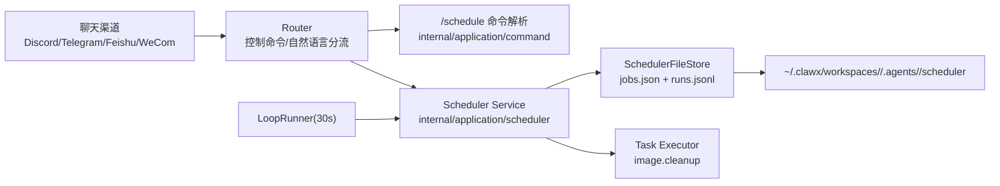

# Unified Scheduler Center 使用指导（版本：v1.0）

## 1. 功能背景与目标

### 1.1 为什么要做
- 业务背景：ClawX 需要统一管理周期性任务，不再依赖分散脚本。
- 当前痛点：任务创建、暂停、恢复、清理、审计缺少统一入口；跨项目/跨 Agent 风险高。
- 目标收益：通过统一 `/schedule` 能力 + 自然语言映射，建立可治理、可恢复、可观测的定时中心。

### 1.2 本文解决什么问题
- 面向角色：研发、QA、运维、平台管理员。
- 本文范围：007-unified-scheduler-center 的实际落地使用方式与验证方式。
- 非本文范围：外部编排器（如 Kubernetes CronJob）接入与多节点分布式锁。

## 2. 角色与适用范围

| 角色 | 关注点 | 主要文档 |
|---|---|---|
| 研发 | 如何新增/执行定时任务，如何接任务类型 | US1、US2 |
| QA | 如何做功能与隔离验收 | US1、US3、US4 |
| 运维 | 如何看状态、失败原因、重启恢复 | US4 |
| 平台管理员 | 如何保证 project+agent 隔离 | US3 |

默认作用域：`project + agent`。默认时区：UTC（若项目配置时区则以项目配置优先）。

## 3. 整体架构与模块关系

模块关系说明：
- 命令入口：Router 将 `/schedule ...` 或自然语言映射成标准控制命令。
- 调度核心：Scheduler Service 负责增删改查、执行、状态流转、失败记录。
- 持久化：`SchedulerFileStore` 负责任务定义与运行记录落盘。
- 执行器：内置 `image.cleanup` 任务执行图片集合清理。
- 运行器：`LoopRunner` 周期 Tick，拉起到期任务。

## 4. Use Case 文档索引

| Use Case | 文件 | 适用角色 | 独立验收口径 |
|---|---|---|---|
| US1 统一注册与管理 | `usecase-us1-schedule-lifecycle.md` | 研发、QA | `add/list/status/pause/resume/run/remove` 全链路 |
| US2 自然语言注册图片清理 | `usecase-us2-nl-image-cleanup.md` | 研发、QA、产品 | 自然语言成功映射、默认策略正确 |
| US3 多项目与多 Agent 隔离 | `usecase-us3-scope-isolation.md` | QA、平台管理员 | 无跨 project/agent 可见与可执行 |
| US4 可观测与恢复治理 | `usecase-us4-observability-recovery.md` | 运维、QA | 失败可追踪、重启后任务继续调度 |

## 5. 前置条件与依赖
- ClawX 服务可启动：`go run ./cmd/clawx serve`
- 已进入目标项目上下文（`/project use <project_id>`）
- 测试环境可写 `~/.clawx/workspaces/`
- 若验证图片清理：需要存在 `.image/collections/` 目录和历史集合

## 6. 验收总标准
- `/schedule` 七个动作均可执行并返回明确结果。
- 自然语言“每周清理图片记录”可直接创建任务（默认周日 03:00，30 天保留）。
- 作用域严格隔离为 `project+agent`，无越权访问。
- 任务失败可见，且任务保持 active 在下周期重试。
- 服务重启后任务定义仍可加载并继续调度。

## 7. 代码实现映射（总览）

| 领域 | 文件 | 说明 |
|---|---|---|
| 命令解析 | `internal/application/command/schedule_command.go` | `/schedule` 语法解析 |
| 路由分流 | `internal/application/service/router.go` | 内建命令识别 + NL 映射 |
| 控制流 | `internal/application/service/router_control_flow.go` | `/schedule` 各动作执行路径 |
| 调度服务 | `internal/application/scheduler/service.go` | 任务生命周期、执行、状态 |
| 调度循环 | `internal/application/scheduler/runner.go` | 30s Tick 调度执行 |
| 图片清理任务 | `internal/application/scheduler/task_image_cleanup.go` | retention 清理逻辑 |
| 持久化 | `internal/infrastructure/persistence/scheduler_file_store.go` | job/run 落盘与读取 |
| 运行时装配 | `cmd/clawx/schedule_command.go` `cmd/clawx/main.go` | service 注入与 runner 启动 |
| 契约测试 | `tests/contract/schedule_*` | 命令/状态/策略契约 |
| 集成测试 | `tests/integration/schedule_*` | E2E、隔离、恢复、观测 |

## 8. 常见问题与排障入口
- 任务看不到：先确认当前项目和当前 Agent，再执行 `/schedule list`。
- 任务不触发：检查是否 `paused`，以及 `next_run_at` 是否到期。
- 自然语言未映射：优先使用标准命令 `/schedule add ...` 验证功能本体。
- 重启后不执行：检查 `jobs.json` 是否存在及 runner 是否启动。

## 9. 回滚与风险控制
- 功能回滚：临时停止调度可通过暂停或删除任务。
- 风险控制：高频任务先用低风险目录验证；先小 retention 再扩大。
- 变更策略：优先新增任务，不直接覆盖线上关键任务。

## 10. 变更记录

| 日期 | 修改人 | 变更内容 |
|---|---|---|
| 2026-03-17 | Codex | 新增 007 功能指导总览与 4 个用例索引 |
