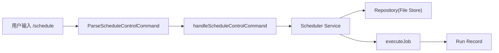
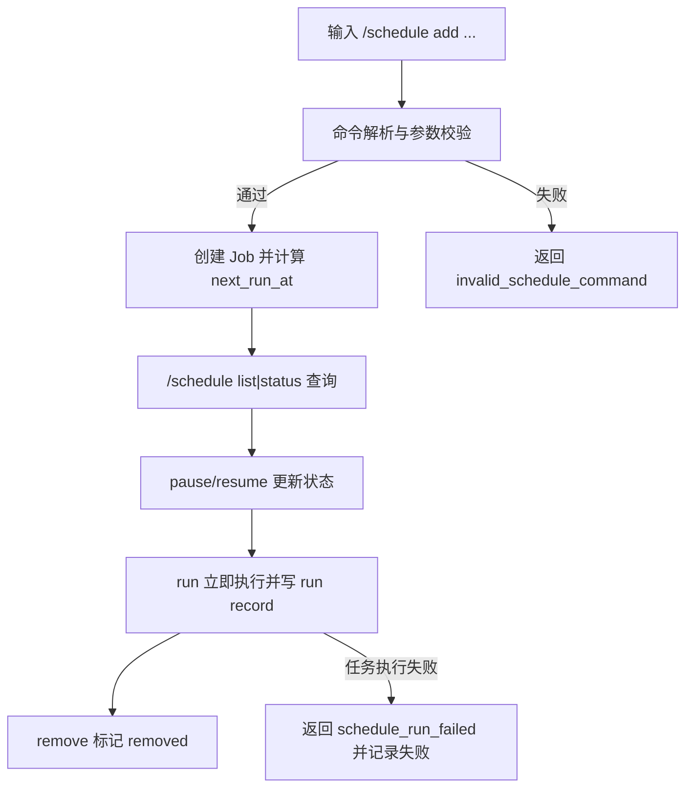
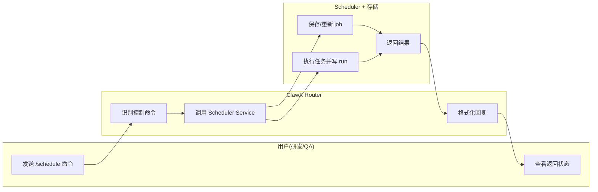

# Use Case US1：统一注册与管理定时任务（版本：v1.0）

## 1. 功能背景与目标
- 目标：在当前 `project+agent` 下完成任务全生命周期管理。
- 范围：`/schedule add|list|status|pause|resume|run|remove`。

## 2. 角色与适用范围
- 研发：接入新任务类型与联调。
- QA：验证命令语义与状态流转。
- 运维：执行临时 run / pause 操作。

## 3. 整体架构与模块关系



## 4. 核心流程



## 5. 跨角色协作流程



## 6. 前置条件与依赖
- 服务已启动：`go run ./cmd/clawx serve`
- 已绑定项目：`/project use image_tools`
- 当前 Agent 可写入 `~/.clawx/workspaces/<project_id>/.agents/<agent_id>/scheduler/`

## 7. 操作步骤

### 7.1 页面操作步骤（聊天窗口）
1. 动作：发送 `/schedule add image-cleanup --cron "0 3 * * 0" --task image.cleanup --arg retention_days=30`。
命令/入口：Discord/Telegram 聊天输入。
预期结果：返回 `定时任务已创建`，包含 `id`、`status`、`next`。
失败处理：若提示冲突，改任务名或先 `/schedule remove image-cleanup`。

2. 动作：发送 `/schedule list`。
命令/入口：聊天输入。
预期结果：出现 `image-cleanup [active]`。
失败处理：若空列表，确认是否在同一项目与同一 Agent。

3. 动作：依次执行 `/schedule pause image-cleanup`、`/schedule resume image-cleanup`、`/schedule run image-cleanup`、`/schedule remove image-cleanup`。
命令/入口：聊天输入。
预期结果：状态分别变为 paused、active、执行完成、removed。
失败处理：若 `schedule_job_not_found`，先 `/schedule list` 获取真实名称。

### 7.2 接口调用步骤（健康检查）
1. 调用命令：
```bash
curl -sSf http://127.0.0.1:8080/healthz
```
2. 预期响应：返回健康状态（HTTP 200）。
3. 失败处理：检查服务端口占用与进程状态。

### 7.3 本地命令步骤（测试验证）
1. 执行契约测试：
```bash
go test ./tests/contract -run 'TestScheduleControlCommandParseContract|TestScheduleControlCommandContractLifecycle' -count=1
```
2. 执行集成测试：
```bash
go test ./tests/integration -run 'TestScheduleCommandFlow' -count=1
```
3. 预期结果：测试通过。
4. 失败处理：根据失败用例名定位对应 `schedule_*_test.go`。

## 8. 预期结果与验收标准
- [ ] 生命周期命令全部成功执行。
- [ ] `list/status` 能反映状态变化。
- [ ] 手工 `run` 生成运行记录。
- [ ] 删除后不再自动触发。

## 9. 代码实现映射

| 文档步骤 | 代码位置 | 说明 |
|---|---|---|
| 命令解析 | `internal/application/command/schedule_command.go` | add/list/status/pause/resume/run/remove |
| 控制分发 | `internal/application/service/router_control_flow.go` | handleScheduleControlCommand |
| 生命周期逻辑 | `internal/application/scheduler/service.go` | Add/List/Status/Pause/Resume/RunNow/Remove |
| 持久化 | `internal/infrastructure/persistence/scheduler_file_store.go` | jobs/runs 文件存储 |
| 回归测试 | `tests/contract/schedule_command_contract_test.go` | 命令契约 |

## 10. 常见问题与排障
- Q1：提示 `invalid_schedule_command`。
现象：参数缺失或 `--arg` 不是 `k=v`。
排查命令：复核 add 命令格式，尤其 `--cron`、`--task`。
修复建议：按契约示例重发。

- Q2：提示 `schedule_job_running`。
现象：同一任务正在执行时再次 run。
排查命令：`/schedule status <name>`。
修复建议：等待前一次执行结束再触发。

## 11. 回滚与风险控制
- 回滚开关：先 `pause`，确认无误再 `remove`。
- 回滚步骤：`/schedule pause <job>` -> `/schedule remove <job>`。
- 风险提示：删除后不会再自动触发，需重新创建。

## 12. 变更记录

| 日期 | 修改人 | 变更内容 |
|---|---|---|
| 2026-03-17 | Codex | 新增 US1 操作指导 |
