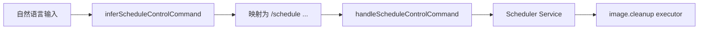
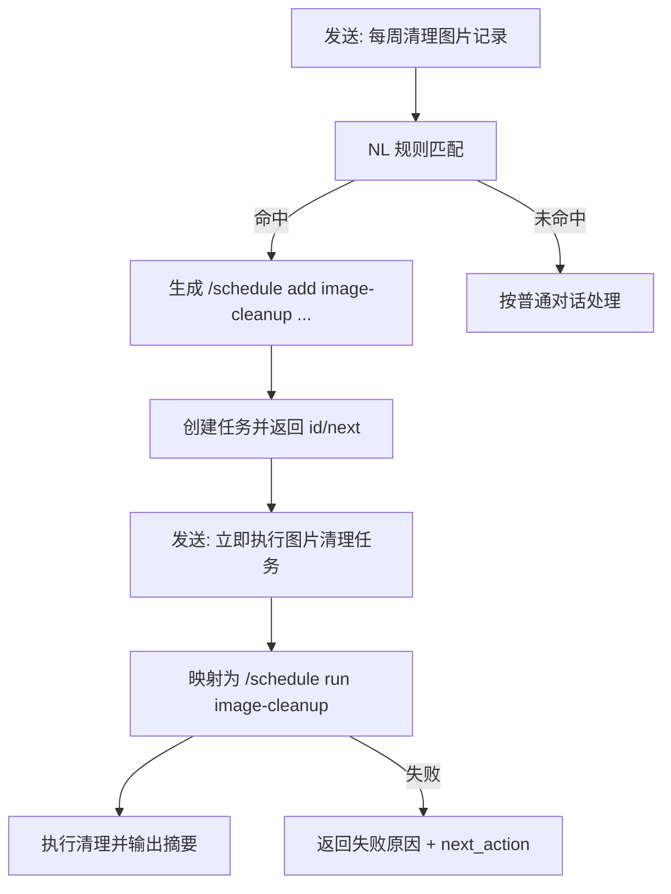
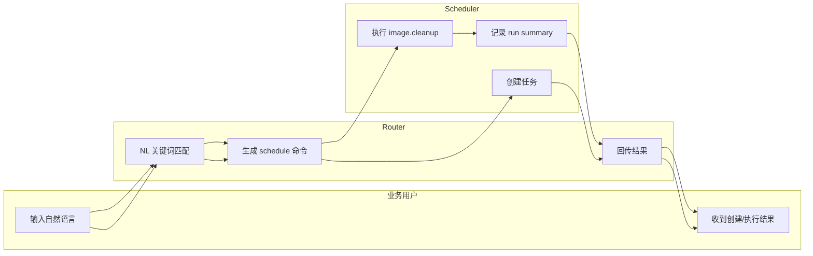

# Use Case US2：自然语言注册图片清理任务（版本：v1.0）

## 1. 功能背景与目标
- 目标：用户只用自然语言即可创建和触发图片清理定时任务。
- 默认策略：每周日 03:00（UTC）执行，`retention_days=30`。

## 2. 角色与适用范围
- 一线使用者：不熟悉命令语法但希望快速建立自动清理。
- QA：验证自然语言映射准确率与默认策略。

## 3. 整体架构与模块关系



## 4. 核心流程



## 5. 跨角色协作流程



## 6. 前置条件与依赖
- 已进入正确项目和 Agent 上下文。
- 当前项目存在或未来会产生 `.image/collections/`。
- 服务运行中且 Router 已注入 schedule service。

## 7. 操作步骤

### 7.1 页面操作步骤（自然语言）
1. 动作：发送 `每周清理图片记录`。
命令/入口：聊天输入。
预期结果：返回“定时任务已创建”，cron 为 `0 3 * * 0`。
失败处理：改用显式命令 `/schedule add ...` 排查。

2. 动作：发送 `查看定时任务`。
命令/入口：聊天输入。
预期结果：能看到 `image-cleanup` 且状态 active。
失败处理：确认仍在同一项目和同一 Agent。

3. 动作：发送 `立即执行图片清理任务`。
命令/入口：聊天输入。
预期结果：返回执行摘要，如 `scan=... deleted=... kept=...`。
失败处理：若不存在任务，先创建再执行。

### 7.2 接口调用步骤（可选）
1. 调用命令：
```bash
curl -sSf http://127.0.0.1:8080/healthz
```
2. 预期响应：HTTP 200。
3. 失败处理：确认 `clawx serve` 是否已启动。

### 7.3 本地命令步骤（自动化验证）
1. 运行自然语言映射集成测试：
```bash
go test ./tests/integration -run 'TestScheduleNaturalLanguageMapping|TestScheduleMetricsNaturalLanguageSuccess' -count=1
```
2. 运行默认策略契约测试：
```bash
go test ./tests/contract -run 'TestScheduleDefaultPolicyContract' -count=1
```
3. 预期结果：测试通过，默认 cron/retention 符合规格。

## 8. 预期结果与验收标准
- [ ] 自然语言可创建 `image.cleanup` 任务。
- [ ] 默认 cron 为每周日 03:00（UTC）。
- [ ] 默认 retention 为 30 天。
- [ ] 自然语言可触发立即执行。

## 9. 代码实现映射

| 文档步骤 | 代码位置 | 说明 |
|---|---|---|
| NL 映射 | `internal/application/service/router.go` | inferScheduleControlCommand |
| 命令执行 | `internal/application/service/router_control_flow.go` | handleScheduleControlCommand |
| 默认策略 | `internal/application/scheduler/service.go` | image.cleanup 默认 retention=30 |
| 清理执行 | `internal/application/scheduler/task_image_cleanup.go` | 扫描/删除/保留逻辑 |
| 映射测试 | `tests/integration/schedule_nl_mapping_test.go` | NL 输入到命令映射 |

## 10. 常见问题与排障
- Q1：自然语言没有创建任务。
现象：回复普通对话而非“任务已创建”。
排查命令：改发 `/schedule add image-cleanup --cron "0 3 * * 0" --task image.cleanup --arg retention_days=30`。
修复建议：先验证命令链路，确认功能后再调优 NL 关键词。

- Q2：执行结果 `scan=0`。
现象：没有发现可清理集合。
排查命令：检查 `~/.clawx/workspaces/<project_id>/.image/collections/`。
修复建议：先新增测试集合再 run。

## 11. 回滚与风险控制
- 回滚开关：`/schedule pause image-cleanup`。
- 回滚步骤：暂停 -> 检查目录 -> 调整 retention -> 恢复。
- 风险提示：retention 太小会清理过多历史内容。

## 12. 变更记录

| 日期 | 修改人 | 变更内容 |
|---|---|---|
| 2026-03-17 | Codex | 新增 US2 自然语言指导 |
