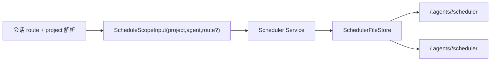
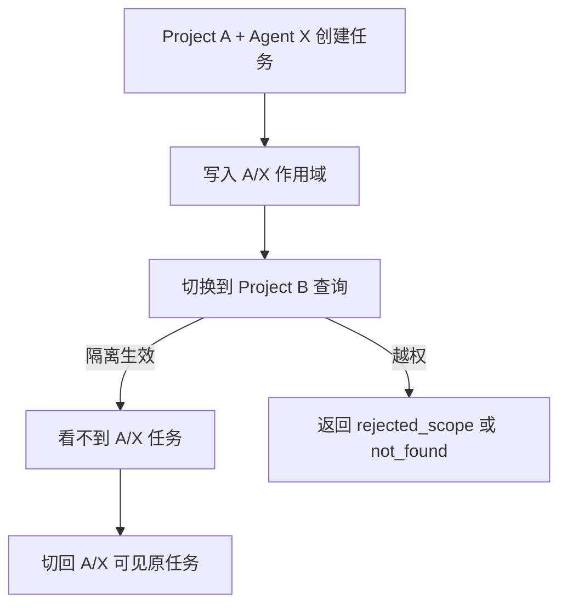
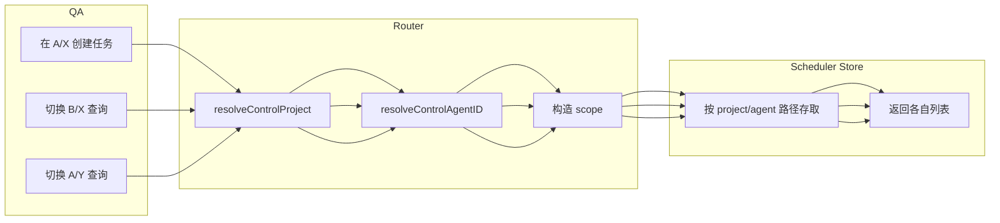

# Use Case US3：多项目与多 Agent 作用域隔离（版本：v1.0）

## 1. 功能背景与目标
- 目标：确保任务在 `project+agent` 边界内可见、可改、可执行。
- 价值：防止跨项目或跨 Agent 误操作。

## 2. 角色与适用范围
- 平台管理员：验证隔离策略是否符合安全边界。
- QA：执行跨项目、跨 Agent 对照测试。

## 3. 整体架构与模块关系



## 4. 核心流程



## 5. 跨角色协作流程



## 6. 前置条件与依赖
- 至少准备两个项目（如 `image_tools`、`memo`）或两个 Agent。
- 已能切换项目与 Agent 上下文。
- 调度存储目录可访问。

## 7. 操作步骤

### 7.1 页面操作步骤
1. 动作：在 Project A + Agent X 执行创建。
命令/入口：`/schedule add iso-job --cron "0 3 * * 0" --task image.cleanup`。
预期结果：A/X 下创建成功。
失败处理：若冲突，改名后重试。

2. 动作：切到 Project B（或 Agent Y）后执行 `/schedule list`。
命令/入口：聊天输入。
预期结果：看不到 A/X 的 `iso-job`。
失败处理：检查是否真正切换了项目或 Agent。

3. 动作：回到 A/X 执行 `/schedule status iso-job`。
命令/入口：聊天输入。
预期结果：可看到任务详情。
失败处理：若 not found，复核创建步骤是否在正确作用域。

### 7.2 接口调用步骤（可选健康检查）
```bash
curl -sSf http://127.0.0.1:8080/healthz
```
预期：HTTP 200。

### 7.3 本地命令步骤（自动化验证）
1. 项目隔离测试：
```bash
go test ./tests/integration -run 'TestScheduleScopeProjectIsolation' -count=1
```
2. Agent 隔离测试：
```bash
go test ./tests/integration -run 'TestScheduleScopeAgentIsolation' -count=1
```
3. ACL 契约测试：
```bash
go test ./tests/contract -run 'TestScheduleScopeACLContract' -count=1
```

## 8. 预期结果与验收标准
- [ ] 不同 project 任务互不可见。
- [ ] 同 project 不同 agent 私有任务互不可见。
- [ ] 运行和修改也必须受相同隔离约束。

## 9. 代码实现映射

| 文档步骤 | 代码位置 | 说明 |
|---|---|---|
| 作用域构建 | `internal/application/service/router_control_flow.go` | project + agent + route scope |
| 项目解析 | `internal/application/service/router_control_flow.go` | resolveControlProject |
| Agent 解析 | `internal/application/service/router_control_flow.go` | resolveControlAgentID |
| 文件隔离路径 | `internal/infrastructure/persistence/scheduler_file_store.go` | `<project>/.agents/<agent>/scheduler` |
| 隔离测试 | `tests/integration/schedule_scope_project_isolation_test.go` `tests/integration/schedule_scope_agent_isolation_test.go` | 跨域隔离校验 |

## 10. 常见问题与排障
- Q1：为什么查到了不该看到的任务。
现象：跨作用域出现同名任务。
排查命令：确认当前 project 和当前 agent；检查任务实际落盘目录。
修复建议：核对 route/session 绑定，必要时重建绑定。

- Q2：不同作用域任务同名冲突。
现象：误以为全局冲突。
排查命令：分别在两个作用域 `/schedule list`。
修复建议：同名允许，但各作用域独立维护。

## 11. 回滚与风险控制
- 回滚开关：发现越权风险先暂停相关任务。
- 回滚步骤：`pause` -> `remove` -> 清理错误作用域数据。
- 风险提示：手工移动任务文件会破坏隔离，请仅通过命令操作。

## 12. 变更记录

| 日期 | 修改人 | 变更内容 |
|---|---|---|
| 2026-03-17 | Codex | 新增 US3 隔离指导 |
