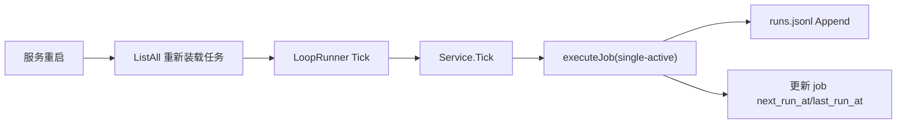
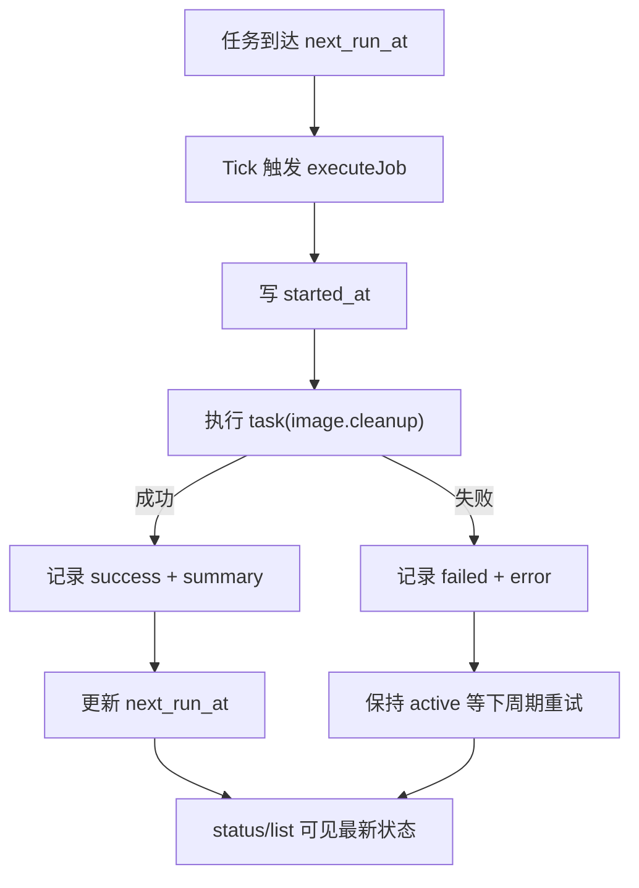
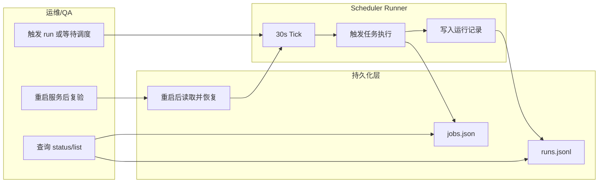

# Use Case US4：记执行记录、可观测与重启恢复（版本：v1.0）

## 1. 功能背景与目标
- 目标：任务执行可追踪、失败可定位、服务重启后自动恢复调度。
- 范围：run record、失败策略、runner 恢复与持续执行。

## 2. 角色与适用范围
- 运维：观察任务状态、失败原因、恢复情况。
- QA：验证失败隔离、重启恢复与时效指标。

## 3. 整体架构与模块关系



## 4. 核心流程



## 5. 跨角色协作流程



## 6. 前置条件与依赖
- 已至少存在一个 active 任务。
- 服务按 `go run ./cmd/clawx serve` 启动，runner 已随运行时启动。
- 可读写 `~/.clawx/workspaces/<project>/.agents/<agent>/scheduler/`。

## 7. 操作步骤

### 7.1 页面操作步骤
1. 动作：执行 `/schedule run image-cleanup`。
命令/入口：聊天输入。
预期结果：返回 `result=success|failed` 和 `summary`。
失败处理：若失败，执行 `/schedule status image-cleanup` 查看最近错误。

2. 动作：执行 `/schedule status image-cleanup`。
命令/入口：聊天输入。
预期结果：能看到 `last`、`next`、失败原因（若有）。
失败处理：若 not found，确认当前作用域。

3. 动作：重启 ClawX 服务后再次 `/schedule list`。
命令/入口：服务重启 + 聊天输入。
预期结果：任务仍存在并继续调度。
失败处理：检查 scheduler 持久化文件与 runner 启动日志。

### 7.2 接口调用步骤
```bash
curl -sSf http://127.0.0.1:8080/healthz
```
预期：健康检查通过。

### 7.3 本地命令步骤（观测/恢复测试）
1. 重启恢复测试：
```bash
go test ./tests/integration -run 'TestScheduleRestartRecovery' -count=1
```
2. 失败策略测试：
```bash
go test ./tests/integration -run 'TestScheduleFailureIsolation|TestScheduleFailKeepActiveAfterFailure' -count=1
```
3. 时效/指标测试：
```bash
go test ./tests/integration -run 'TestScheduleMetricsFirstUseToScheduleCreated|TestScheduleMetricsTimeliness' -count=1
```

## 8. 预期结果与验收标准
- [ ] 每次执行都有 run record（started/ended/result/summary）。
- [ ] 失败后任务保持 active，下周期继续执行。
- [ ] 服务重启后任务定义不丢失且可继续触发。
- [ ] 单任务同一时间仅允许一个活动执行实例。

## 9. 代码实现映射

| 文档步骤 | 代码位置 | 说明 |
|---|---|---|
| 调度循环 | `internal/application/scheduler/runner.go` | LoopRunner 30s Tick |
| 执行与记录 | `internal/application/scheduler/service.go` | executeJob + 并发保护 + 状态更新 |
| 失败策略 | `internal/application/scheduler/service.go` | 失败保持 active |
| 清理摘要 | `internal/application/scheduler/task_image_cleanup.go` | scan/deleted/kept/failed |
| 持久化恢复 | `internal/infrastructure/persistence/scheduler_file_store.go` | ListAll + runs append/read |
| 装配启动 | `cmd/clawx/main.go` `cmd/clawx/schedule_command.go` | runner 注入和启动 |

## 10. 常见问题与排障
- Q1：重启后任务不执行。
现象：`list` 有任务但长时间不触发。
排查命令：看服务日志是否有 runner 错误；检查 `next_run_at`。
修复建议：确认 `runServe` 中 scheduler runner 成功启动。

- Q2：任务总是失败。
现象：`status` 持续显示最近失败。
排查命令：检查 `retention_days` 是否非法；检查图片目录权限。
修复建议：修正参数后手工 `run` 验证。

## 11. 回滚与风险控制
- 回滚开关：快速 `pause` 有问题任务。
- 回滚步骤：`/schedule pause <job>` -> 修复 -> `/schedule resume <job>`。
- 风险提示：直接删除运行记录会降低可追溯性，不建议手工改文件。

## 12. 变更记录

| 日期 | 修改人 | 变更内容 |
|---|---|---|
| 2026-03-17 | Codex | 新增 US4 观测与恢复指导 |
